# Core Flows: ruley User Journeys

## Overview

This document defines the core user flows for ruley, covering the complete user journey from first-time setup through regular usage. Each flow describes the user's entry point, actions, system responses, and exit point.

---

## Flow 1: First-Time User (Missing API Key)

**Description**: New user runs ruley without configuring API keys

**Entry Point**: User runs `ruley` in their project directory

**Steps**:

1. User executes `ruley` command
2. System checks for API key from three sources (in precedence order):

- Command line flag
- Environment variable (ANTHROPIC_API_KEY or OPENAI_API_KEY)
- Config file (ruley.toml)

3. System detects missing API key in all sources
4. System displays contextual error message:

```
 Error: API key not found

 What happened:
 ├─ Attempting to connect to Anthropic Claude
 └─ No API key found

 How to fix:
 Set the ANTHROPIC_API_KEY environment variable:

   export ANTHROPIC_API_KEY=sk-...

 Get your key at: https://console.anthropic.com/

 Note: You can also configure via ruley.toml or CLI flags

 Alternative:
 • Use OpenAI with --provider openai (requires OPENAI_API_KEY)
```

5. User sets environment variable: `export ANTHROPIC_API_KEY=sk-...` (Advanced users may choose config file or CLI flag instead)
6. User re-runs `ruley`
7. System proceeds to Flow 2 (Basic Usage)

**Exit Point**: User has configured API key and can proceed with rule generation

---

## Flow 2: Basic Usage (Happy Path)

**Description**: User generates AI IDE rules for their project

**Entry Point**: User runs `ruley` in project directory with valid API key

**Steps**:

1. **Configuration Discovery**

- System loads configuration from three sources (in precedence order):

1. Command line flags (highest precedence, managed by `clap`)
2. Environment variables (middle precedence, managed by `clap`)
3. Config file (lowest precedence, managed by `config` crate) System merges all sources with proper precedence
4. **Input Source Selection**

- If `--repomix-file` is provided, skip to Flow 10 (Using Existing Repomix File)
- Otherwise, proceed with file scanning

3. **File Scanning** (Progress: "Scanning files...")

- System walks directory tree, respecting .gitignore
- Progress bar shows: files discovered, directories scanned
- System applies include/exclude patterns if specified

4. **Code Compression** (Progress: "Compressing code...")

- System applies tree-sitter compression to supported languages (TypeScript, Python, Rust, Go)
- If tree-sitter parsing fails for a file, falls back to simple whitespace compression
- Progress bar shows: files processed, compression ratio, any fallback warnings
- System calculates token counts using provider-specific tokenizers:
  - OpenAI: tiktoken (cl100k_base)
  - Anthropic: Anthropic's tokenizer

5. **Cost Estimation**

- System displays detailed breakdown:
  ```
  Analysis Summary:
  ├─ Files: 127 files (45 TypeScript, 32 Python, 50 other)
  ├─ Tokens: 48,234 (before compression: 156,891)
  ├─ Compression: 69% reduction
  └─ Estimated cost: $0.14 (Anthropic Claude Sonnet)

  Continue? [Y/n]
  ```
- User confirms or cancels

6. **LLM Analysis** (Progress: "Analyzing codebase...")

- System sends compressed codebase to LLM
- If chunked (due to context limits), processes each chunk sequentially:
  - Progress: "Analyzing chunk 1/3... chunk 2/3... chunk 3/3..."
  - After all chunks complete, makes final merge call to combine insights
- Progress bar shows: tokens sent, time elapsed
- System receives analysis response

7. **Format-Specific Refinement** (if multiple formats)

- For each additional format, system makes refinement call
- Progress: "Generating Cursor format... Claude format... Copilot format..."

8. **Output Writing**

- System checks for existing output files
- If files exist, proceed to Flow 3 (Existing Files)
- If no conflicts, write files to conventional locations:
  - Cursor: `.cursor/rules/project.mdc`
  - Claude: `CLAUDE.md`
  - Copilot: `.github/copilot-instructions.md`

9. **Success Summary**

```
 ✓ Rules generated successfully

 Output Files:
 ├─ Cursor: .cursor/rules/project.mdc (3.2 KB)
 ├─ Claude: CLAUDE.md (2.8 KB)
 └─ Copilot: .github/copilot-instructions.md (2.1 KB)

 Statistics:
 ├─ Files analyzed: 127
 ├─ Tokens processed: 48,234
 ├─ Actual cost: $0.14
 └─ Time: 12.3s

 Next Steps:
 • Restart your AI IDE to load the new rules
 • Test AI suggestions in your codebase
 • Re-run ruley when conventions change
```

**Exit Point**: Rules are generated and user knows where to find them

```mermaid
sequenceDiagram
    participant User
    participant ruley
    participant FileSystem
    participant LLM
    
    User->>ruley: ruley
    ruley->>FileSystem: Scan files
    FileSystem-->>ruley: File list
    ruley->>ruley: Compress code
    ruley->>User: Show cost estimate
    User->>ruley: Confirm
    ruley->>LLM: Analyze codebase
    LLM-->>ruley: Analysis response
    ruley->>LLM: Format-specific refinements
    LLM-->>ruley: Formatted rules
    ruley->>FileSystem: Write output files
    ruley->>User: Success summary
```



---

## Flow 3: Existing Files (Overwrite/Merge/Skip)

**Description**: User regenerates rules when output files already exist

**Entry Point**: During output writing in Flow 2, system detects existing files

**Steps**:

1. System detects existing output file (e.g., `.cursor/rules/project.mdc`)
2. System prompts user with options:

```
 File exists: .cursor/rules/project.mdc

 Choose action:
```

1. Overwrite (backup existing file to .cursor/rules/project.mdc.bak)
2. Smart merge (use existing rules as context for LLM)
3. Skip this file
4. Apply to all remaining files oice \[1-4\]:\
   \`
5. User selects option:

- **Overwrite**: System renames existing file to `.bak`, writes new file
- **Smart merge**: System reads existing file, includes it as context in LLM call, generates merged rules (see Technical Clarifications for details)
- **Skip**: System skips this file, continues to next format
- **Apply to all**: System applies choice to all remaining files without prompting

4. System proceeds with selected action
5. Return to Flow 2 (Output Writing)

**Exit Point**: All output files are handled according to user preference

---

## Flow 4: Dry-Run Mode

**Description**: User previews what would be analyzed without spending money on LLM calls

**Entry Point**: User runs `ruley --dry-run`

**Steps**:

1. User executes `ruley --dry-run`
2. System performs file scanning (same as Flow 2)
3. System performs code compression (same as Flow 2)
4. System displays preview:

```
 Dry Run - No LLM calls will be made

 Files to be analyzed:
 ├─ TypeScript (45 files, 12,345 tokens)
 │  ├─ src/main.ts (234 tokens)
 │  ├─ src/lib.ts (189 tokens)
 │  └─ ... (43 more files)
 ├─ Python (32 files, 8,901 tokens)
 │  └─ ...
 └─ Other (50 files, 26,988 tokens)

 Total: 127 files, 48,234 tokens
 Compression: 69% reduction (from 156,891 tokens)
 Estimated cost: $0.14

 Output formats: cursor, claude, copilot
 Output locations:
 ├─ .cursor/rules/project.mdc
 ├─ CLAUDE.md
 └─ .github/copilot-instructions.md
```

5. System exits without calling LLM

**Exit Point**: User has preview of what would be analyzed and can adjust configuration

---

## Flow 5: Configuration File Usage

**Description**: User creates project-specific configuration to avoid repeating CLI flags

**Entry Point**: User creates `ruley.toml` in project root

**Steps**:

1. User creates configuration file:

```toml
[general]
provider = "anthropic"
model = "claude-sonnet-4-5-20250929"
format = "cursor,claude"
compress = true
no_confirm = false

[include]
patterns = ["**/*.ts", "**/*.tsx"]

[exclude]
patterns = ["**/node_modules/**", "**/dist/**"]
```

2. User runs `ruley` (without flags)
3. System loads configuration from three sources: **Config File** (lowest precedence, via `config` crate):

- Checks current directory for `ruley.toml`
- Checks parent directories up to git repository root
- Checks user config directory (`~/.config/ruley/config.toml`)
- First match wins (see Technical Clarifications for details)\
  **Environment Variables** (middle precedence, via `clap`):
- `RULEY_PROVIDER`, `RULEY_MODEL`, `RULEY_FORMAT`, etc.
- Automatically read by `clap` using `#[arg(env = "RULEY_*")]`\
  **Command Line Flags** (highest precedence, via `clap`):
- Explicitly provided flags override everything

4. System merges configuration with proper precedence:

- Config file provides base defaults
- Environment variables override config file
- CLI arguments override both

5. System proceeds with merged configuration to Flow 2

**Exit Point**: User can run ruley with consistent settings without repeating flags

---

## Flow 6: Multi-Format Output

**Description**: User generates rules for multiple AI IDEs in one run

**Entry Point**: User runs `ruley --format cursor,claude,copilot`

**Steps**:

1. User specifies multiple formats via CLI or config
2. System performs file scanning and compression (Flow 2, steps 1-3)
3. System shows cost estimate including refinement calls:

```
 Analysis Summary:
 ├─ Initial analysis: $0.14
 ├─ Format refinements: $0.06 (3 formats × $0.02)
 └─ Total estimated cost: $0.20
```

4. User confirms
5. System makes single analysis LLM call with generic prompt
6. System makes format-specific refinement calls:

- Cursor: Refine for `.mdc` format with rule types (Always Apply, Apply Intelligently, Apply to Specific Files, Apply Manually)
- Claude: Refine for `CLAUDE.md` format
- Copilot: Refine for GitHub Copilot instructions format
- See Technical Clarifications for rule type details

7. System writes all output files (checking for conflicts per Flow 3)
8. System shows success summary with all file locations

**Exit Point**: User has rules for all requested formats

---

## Flow 7: Error Handling

**Description**: System encounters an error during rule generation

**Entry Point**: Error occurs at any stage of Flow 2

**Steps**:

1. Error occurs (examples: network timeout, LLM rate limit, file system error)
2. System displays contextual error message:

```
 Error: Failed to analyze codebase

 What happened:
 ├─ Stage: Analyzing codebase with Anthropic Claude
 ├─ Error: Rate limit exceeded (429)
 └─ Tokens sent: 48,234

 Suggestion:
 • Wait 60 seconds and try again
 • Or use --provider openai to switch providers
 • Or reduce scope with --include patterns

 For more details, run with --verbose
```

3. User can:

- Retry the command
- Adjust configuration based on suggestion
- Run with `--verbose` for detailed error information (stack trace, debug logs)

**Exit Point**: User understands what went wrong and how to fix it

---

## Flow 8: Custom Focus Area

**Description**: User generates rules focused on specific aspects of the codebase

**Entry Point**: User runs `ruley --description "authentication and security patterns"`

**Steps**:

1. User provides focus area via `--description` flag
2. System performs file scanning and compression (Flow 2, steps 1-3)
3. System includes focus area in LLM prompt:

- "Analyze this codebase with special attention to: authentication and security patterns"

4. LLM generates rules emphasizing the specified focus area
5. System proceeds with output writing (Flow 2, steps 7-8)

**Exit Point**: User has rules tailored to their specific needs

---

## Flow 10: Using Existing Repomix File

**Description**: User provides an existing repomix file to skip file scanning and compression

**Entry Point**: User runs `ruley --repomix-file path/to/repo.txt`

**Steps**:

1. User executes `ruley --repomix-file path/to/repo.txt`
2. System validates repomix file exists and is readable
3. System parses repomix file:

- Supports markdown, XML, and JSON formats (standard repomix formats)
- If parsing fails, passes entire file content unparsed to LLM
- See Technical Clarifications for format details

4. System skips file scanning and compression phases
5. System calculates token count from repomix content
6. System shows cost estimation:

```
 Analysis Summary:
 ├─ Source: repomix file (path/to/repo.txt)
 ├─ Tokens: 48,234
 └─ Estimated cost: $0.14 (Anthropic Claude Sonnet)

 Note: Using pre-processed repomix file

 Continue? [Y/n]
```

07. User confirms
08. System proceeds directly to LLM analysis (Flow 2, step 5)
09. System generates and writes output files
10. System shows success summary

**Benefits**:

- Faster iteration when experimenting with prompts/formats
- Useful in CI/CD where repomix is generated once and reused
- Consistent input across multiple ruley runs

**Limitations**:

- Cannot show file type breakdown (unless repomix includes metadata)
- Cannot show compression statistics
- User responsible for keeping repomix file up-to-date

**Exit Point**: Rules are generated from repomix file content

---

## Flow 9: Incremental Updates

**Description**: User regenerates rules after codebase changes

**Entry Point**: User runs `ruley` after making changes to codebase

**Steps**:

1. User runs `ruley` (same command as initial generation)
2. System detects existing output files
3. System prompts for action (Flow 3)
4. User selects "Smart merge"
5. System performs smart merge (see Technical Clarifications section):

- Reads existing rules file
- Includes existing rules as context in LLM prompt
- LLM generates updated rules that merge old and new insights

6. System writes merged rules
7. System shows diff summary:

```
 ✓ Rules updated successfully

 Changes:
 ├─ .cursor/rules/project.mdc
 │  ├─ Added: 3 new patterns
 │  ├─ Updated: 2 existing rules
 │  └─ Removed: 1 deprecated rule
 └─ CLAUDE.md
    └─ Updated: Architecture section
```

**Exit Point**: User has up-to-date rules that reflect current codebase state

---

## Technical Clarifications

### Smart Merge Process

- **What it does**: Reads existing rules file, includes full content as context in LLM prompt
- **Prompt structure**: "Previous rules: [existing content]\\nCodebase has changed. Update rules to reflect current state while preserving valid existing rules."
- **Output**: LLM generates new rules that incorporate both old insights and new patterns
- **Cost**: Requires one additional LLM call with existing rules + new codebase as input

### Repomix File Support

- **Supported formats**: Markdown, XML, JSON (standard repomix formats)
- **Parsing strategy**: Attempt to parse as structured format; if parsing fails, pass entire file content unparsed to LLM
- **Benefit**: Allows flexibility - users can provide any text-based codebase representation

### Context Limit Handling

- **Detection**: After compression, if token count exceeds provider's context limit
- **Strategy**: Automatically chunk codebase into multiple segments
- **Processing**: Make separate LLM call for each chunk, then final merge call to combine insights
- **User experience**: Show updated cost estimate with chunk count, require confirmation
- **Progress**: Display "Analyzing chunk 1/N... chunk 2/N..." during processing

### Token Counting

- **Provider-specific**: Use appropriate tokenizer for each provider
  - OpenAI: tiktoken (cl100k_base encoding)
  - Anthropic: Anthropic's official tokenizer
- **Purpose**: Accurate cost estimation and context limit detection
- **Accuracy**: Best-effort approximations - actual costs may vary slightly

### Cursor Rule Types

- **Always Apply**: Rules that apply to all code generation in the project
- **Apply Intelligently**: Rules that Cursor decides when to apply based on context
- **Apply to Specific Files**: Rules scoped to particular file patterns or directories
- **Apply Manually**: Rules that user explicitly invokes when needed
- **Note**: Similar concepts exist for other AI agents (e.g., Kiro steering files, Copilot instructions)

### Tree-sitter Compression Fallback

- **Primary**: Use tree-sitter for TypeScript, Python, Rust, Go
- **Fallback**: If parsing fails (syntax errors, unsupported features), use simple whitespace compression
- **User feedback**: Show warning in progress bar when fallback is used
- **Impact**: Fallback compression is less effective (~30-40% vs ~70% reduction) but ensures all files are included

### Config File Discovery

- **Search path** (in order):
  1. Current directory: `./ruley.toml`
  2. Parent directories: Walk up to git repository root
  3. User config directory: `~/.config/ruley/config.toml`
- **First match wins**: Stop searching once a config file is found
- **Merge behavior**: Config file provides defaults, environment variables override, CLI flags override all

### Include/Exclude Patterns

- **Syntax**: Standard gitignore syntax (via `ignore` crate)
- **Examples**:
  - `**/*.ts` - All TypeScript files
  - `**/node_modules/**` - Exclude node_modules
  - `src/**/*.test.ts` - Test files in src directory
- **Behavior**: Include patterns are additive, exclude patterns are subtractive
- **Default**: Respects .gitignore automatically

---

## Key UX Principles

1. **Transparency**: Always show what's happening (progress bars, detailed feedback)
2. **Cost Awareness**: Show estimates before spending money, display actual costs after
3. **Helpful Errors**: Contextual error messages with actionable suggestions
4. **Smart Defaults**: Convention-based paths, auto-discovery of config
5. **User Control**: Prompt for destructive actions, allow customization via config
6. **Progressive Disclosure**: Simple by default, detailed with `--verbose`
7. **Efficiency**: Single analysis, multiple formats; smart merging for updates
