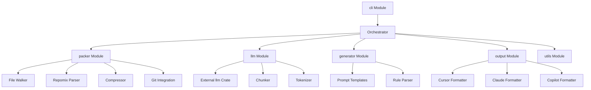
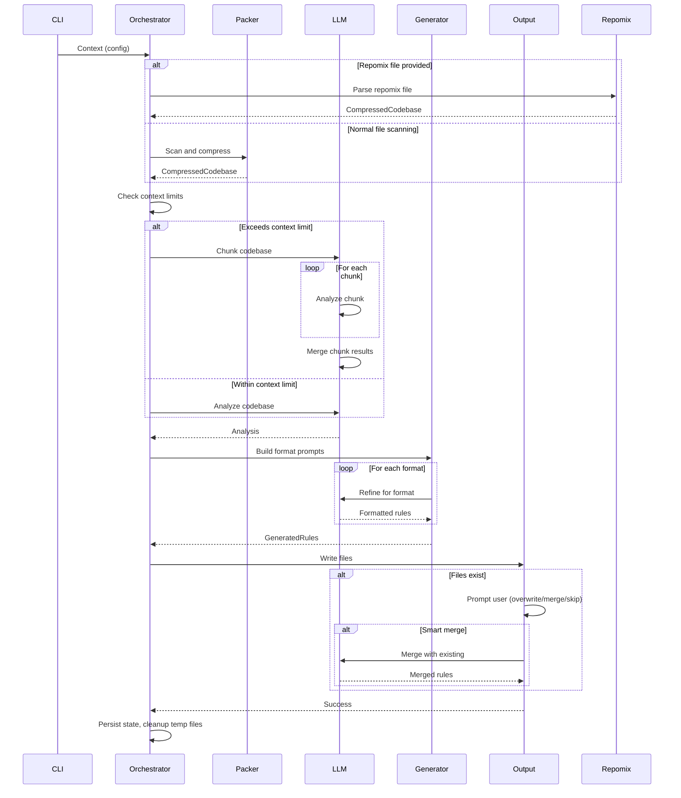

# Technical Plan: ruley v1.0.0 Architecture

## Architectural Approach

### Core Design Pattern: Context-Driven Pipeline

ruley uses a **context-driven pipeline architecture** where a mutable `Context` object flows through sequential stages. Each stage reads configuration and previous results from the context, performs its work, and updates the context with new data.

**Key Architectural Decisions:**

1. **Pipeline Orchestration**

- **Pattern**: Context object passed through stages (config → input → compress → analyze → output)
- **Rationale**: Flexible for adding new stages, easy to add state, supports error recovery
- **Trade-off**: More memory than pure functional pipeline, but enables recovery and debugging

2. **LLM Provider Integration**

- **Decision**: Use external `llm` crate v1.x directly, remove custom provider implementations
- **Rationale**: Leverage maintained multi-provider support, reduce code maintenance burden
- **Impact**: Simplifies llm module, removes llm/providers/\* custom implementations
- **Trade-off**: Dependency on external crate, but gains broad provider support
- **Verification Required**: Confirm `llm` crate supports Anthropic Claude and OpenAI GPT with required features (streaming, error handling, tokenization)

3. **Hybrid Caching Strategy**

- **In-memory**: Cache within single run for format refinements
- **Disk temp files**: Store intermediate results in `.ruley/` directory during run
- **State file**: Persist slim metadata in `.ruley/state.json` for future runs
- **Auto-management**:
  - Automatically create `.ruley/` entry in `.gitignore` if not present
  - Auto-clean old temp files on startup (files older than 24 hours)
  - Handle state file versioning (migrate old formats automatically)
- **Rationale**: Balances memory pressure, supports error recovery, user-friendly
- **Cleanup**: Temp files deleted on success, preserved on error for recovery

4. **Token-Based Chunking with Configurable Overlap**

- **Strategy**: Split at token boundaries when exceeding context limits
- **Overlap**: Configurable overlap percentage (default: 10-20%) using tiktoken library
- **Configuration**: Users can configure chunk_size and overlap_size in ruley.toml
- **Merge**: Final LLM call to deduplicate and synthesize chunk results (accepted cost for quality)
- **Rationale**: Simpler than function-boundary parsing, predictable costs, user control
- **Trade-off**: Additional cost for merge call, but users can reduce scope with --include patterns

5. **Automatic Retry with Exponential Backoff**

- **Scope**: LLM network calls only (not file I/O or compression)
- **Strategy**: Exponential backoff with jitter for rate limits (429) and server errors (500-504)
- **No retry**: Client errors (400, 401, 403) or context length exceeded
- **Rationale**: Transparent error recovery for transient failures, predictable behavior

6. **Three-Tier Configuration System**

- **Implementation**: Use `config` crate for file parsing, custom logic for discovery
- **Precedence**: CLI flags (clap) → Environment variables (clap) → Config file (config crate)
- **Discovery**:
  - Current directory: `./ruley.toml`
  - Walk up to git root: Search parent directories until `.git` found
  - User config: `~/.config/ruley/config.toml` (via `dirs` crate)
- **Rationale**: `config` crate handles format parsing, custom logic for git-aware search
- **Note**: `config` crate doesn't auto-locate files, we implement the search logic

7. **Error Handling Strategy**

- **Public APIs**: Use `thiserror` for structured error types (file:src/utils/error.rs)
- **Internal code**: Use `anyhow` for error context and convenience
- **Propagation**: `?` operator throughout, contextual error messages
- **User experience**: Adaptive - simple by default, detailed with `--verbose`

8. **Progress Reporting**

- **Mechanism**: Use `indicatif::MultiProgress` for thread-safe updates from async stages
- **Pattern**: Each stage gets its own progress bar, MultiProgress renders them together
- **Rationale**: Thread-safe, supports concurrent updates, clean console output
- **Trade-off**: Slightly more setup than single progress bar, but handles async properly

### Constraints and Trade-offs

| Constraint       | Impact                                 | Mitigation                                                                                                 |
| ---------------- | -------------------------------------- | ---------------------------------------------------------------------------------------------------------- |
| LLM costs        | Primary user concern                   | Tree-sitter compression (~70% reduction), cost estimation, user confirmation, chunking only when necessary |
| Context limits   | Large codebases may exceed limits      | Smart chunking with overlap, LLM-based merge, clear user feedback                                          |
| Memory usage     | Accumulating context and temp files    | Hybrid caching with temp file references, cleanup on success                                               |
| Network failures | LLM calls may fail                     | Automatic retry with backoff, temp file recovery, helpful error messages                                   |
| Complexity       | Multiple providers, formats, languages | External `llm` crate, trait-based formatters, feature flags                                                |

---

## Data Model

### Core Data Structures

**1. Pipeline Context**

```rust
struct Context {
    // Configuration (immutable after init)
    config: MergedConfig,

    // Current stage data
    stage: PipelineStage,

    // References to cached data
    temp_files: TempFileRefs,

    // Progress tracking
    progress: ProgressTracker,
}

struct TempFileRefs {
    scanned_files: Option<PathBuf>,   // .ruley/files.json
    compressed_code: Option<PathBuf>, // .ruley/compressed.txt
    llm_responses: Vec<PathBuf>,      // .ruley/chunk-*.json
}

enum PipelineStage {
    Init,
    Scanning { files_found: usize },
    Compressing { files_processed: usize, ratio: f32 },
    Analyzing { chunks: usize, current_chunk: usize },
    Formatting { formats: Vec<String> },
    Writing { files_written: Vec<PathBuf> },
    Complete,
}
```

**2. State File Schema** (`.ruley/state.json`)

```json
{
  "version": "1.0.0",
  "last_run": "2025-01-10T15:30:00Z",
  "user_selections": {
    "file_conflict_action": "smart_merge",
    "apply_to_all": true
  },
  "output_files": [
    ".cursor/rules/project.mdc",
    "CLAUDE.md",
    ".github/copilot-instructions.md"
  ],
  "cost_spent": 0.14,
  "token_count": 48234,
  "compression_ratio": 0.69
}
```

**3. Compressed Codebase Representation**

```rust
struct CompressedCodebase {
    files: Vec<CompressedFile>,
    total_tokens: usize,
    compression_ratio: f32,
    metadata: CodebaseMetadata,
}

struct CompressedFile {
    path: String,
    content: String, // Compressed or original
    tokens: usize,
    language: Option<Language>,
    compression_method: CompressionMethod,
}

enum CompressionMethod {
    TreeSitter { ratio: f32 },
    Whitespace { ratio: f32 },
    None,
}
```

**4. Chunk Structure**

```rust
struct Chunk {
    id: usize,
    content: String, // Chunk content (may span multiple files)
    tokens: usize,
    overlap_tokens: usize, // Configurable overlap from previous chunk
}

struct ChunkConfig {
    chunk_size: usize,   // Max tokens per chunk (default: 100,000)
    overlap_size: usize, // Overlap tokens (default: 10,000 = 10%)
}

struct ChunkResult {
    chunk_id: usize,
    analysis: String, // LLM response for this chunk
    cost: f32,
}
```

**5. Generated Rules Structure**

```rust
struct GeneratedRules {
    analysis: String, // Raw LLM analysis
    rules_by_format: HashMap<String, FormattedRules>,
    metadata: GenerationMetadata,
}

struct FormattedRules {
    format: String,              // "cursor", "claude", "copilot"
    content: String,             // Formatted output
    rule_type: Option<RuleType>, // For Cursor: Always, Intelligent, Specific, Manual
}

struct GenerationMetadata {
    timestamp: DateTime,
    provider: String,
    model: String,
    total_tokens: usize,
    total_cost: f32,
    chunks_processed: usize,
}
```

**6. Repomix File Structure**

```rust
enum RepomixFormat {
    Markdown,
    Xml,
    Json,
    Unparsed(String), // Fallback: pass raw content to LLM
}

struct RepomixFile {
    format: RepomixFormat,
    content: String,
    metadata: Option<RepomixMetadata>,
}
```

---

## Component Architecture

### Module Responsibilities



### 1. CLI Module (file:src/cli/)

**Responsibilities:**

- Parse command-line arguments via clap
- Load and merge configuration from three sources
- Initialize Context object
- Hand off to orchestrator

**Key Components:**

- `args.rs`: Clap argument definitions with env variable support
- `config.rs`: Config file loading and merging via `config` crate

**Integration Points:**

- Outputs: `MergedConfig` and initial `Context` to orchestrator

### 2. Orchestrator (file:src/lib.rs `run()` function)

**Responsibilities:**

- Coordinate pipeline stages
- Manage Context lifecycle
- Handle stage transitions
- Coordinate progress reporting
- Manage temp file cleanup

**Pipeline Stages:**

01. Config discovery and merging
02. Input source selection (repomix vs file scanning)
03. File scanning or repomix parsing
04. Code compression
05. Token counting and chunking
06. Cost estimation and user confirmation
07. LLM analysis (with chunking if needed)
08. Format-specific refinement
09. Output writing with conflict resolution
10. State file persistence and cleanup

**Error Handling:**

- Catch errors at each stage
- Add context with `.context()`
- Display contextual error messages
- Clean up temp files on error

### 3. Packer Module (file:src/packer/)

**Responsibilities:**

- Walk directory tree respecting .gitignore
- Apply include/exclude patterns (gitignore syntax via `ignore` crate)
- Compress code using tree-sitter or whitespace fallback
- Calculate token counts

**Key Components:**

- `walker.rs`: Directory traversal with gitignore support
- `compress.rs`: Tree-sitter compression with whitespace fallback
- `gitignore.rs`: Gitignore pattern matching
- `git.rs`: Git repository detection (for config discovery)

**Integration Points:**

- Input: Config (patterns, compression settings), Context
- Output: `CompressedCodebase` written to temp file, reference in Context

### 4. Repomix Module (new: src/packer/repomix.rs)

**Responsibilities:**

- Parse repomix files (markdown, XML, JSON formats)
- Extract codebase content
- Fallback to unparsed content if parsing fails
- Calculate token counts from repomix content

**Key Components:**

- `repomix.rs`: Format detection and parsing (sub-module of packer)
- Integrated with packer module as alternative input source

**Integration Points:**

- Input: File path from CLI args
- Output: `CompressedCodebase` (same structure as packer::walker output)
- Location: Sub-module of packer (src/packer/repomix.rs)

### 5. LLM Module (file:src/llm/)

**Responsibilities:**

- Interface with external `llm` crate
- Manage chunking for large codebases
- Implement retry logic with exponential backoff
- Calculate provider-specific token counts
- Track costs

**Key Components:**

- `client.rs`: Wrapper around `llm` crate with retry logic
- `chunker.rs`: Token-based chunking with smart overlap
- `tokenizer.rs`: Provider-specific tokenizers (tiktoken for OpenAI, Anthropic tokenizer)

**Integration Points:**

- Input: `CompressedCodebase` or chunks, provider config
- Output: `GeneratedRules` (analysis + metadata)
- Dependencies: External `llm` crate, `tiktoken-rs`, Anthropic SDK

**Chunking Algorithm:**

1. Calculate total tokens using provider-specific tokenizer
2. If exceeds context limit, split into chunks:

- Chunk size: Configurable (default: 100,000 tokens)
- Overlap: Configurable percentage (default: 10,000 tokens = 10%)
- Split at token boundaries using tiktoken library

3. Process each chunk sequentially with progress updates
4. Make final merge call with all chunk results
5. Return synthesized analysis

**Cost Acceptance**: Merge call adds cost but is justified for quality. Users can reduce scope with --include patterns if cost is concern.

**Retry Logic:**

- Retry on: 429 (rate limit), 500-504 (server errors)
- No retry on: 400, 401, 403, context length exceeded
- Exponential backoff: 1s, 2s, 4s, 8s with jitter
- Max retries: 3 attempts

### 6. Generator Module (file:src/generator/)

**Responsibilities:**

- Build prompts for LLM analysis
- Build prompts for format-specific refinement
- Build prompts for chunk merging
- Parse LLM responses into structured rules

**Key Components:**

- `prompts.rs`: Prompt templates for analysis, refinement, merging
- `rules.rs`: Parse LLM responses into `GeneratedRules` structure

**Integration Points:**

- Input: `CompressedCodebase`, focus area, existing rules (for smart merge)
- Output: Prompt strings for LLM
- Reverse: Parse LLM responses into `GeneratedRules`

### 7. Output Module (file:src/output/)

**Responsibilities:**

- Format rules for each AI IDE
- Write files to conventional locations
- Handle file conflicts (overwrite/merge/skip)
- Create backup files

**Key Components:**

- `cursor.rs`: Format for Cursor .mdc with rule types
- `claude.rs`: Format for Claude CLAUDE.md
- `copilot.rs`: Format for GitHub Copilot instructions
- `mod.rs`: `OutputFormatter` trait definition

**Integration Points:**

- Input: `GeneratedRules`, output format config
- Output: Formatted files written to disk
- User interaction: Prompt for conflict resolution

**Trait Definition:**

```rust
trait OutputFormatter {
    fn format(&self, rules: &GeneratedRules) -> Result<String>;
    fn default_path(&self) -> PathBuf;
    fn supports_rule_types(&self) -> bool;
}
```

### 8. Utils Module (file:src/utils/)

**Responsibilities:**

- Define error types (thiserror for public, anyhow for internal)
- Manage progress bars (indicatif)
- Provide common utilities

**Key Components:**

- `error.rs`: `RuleyError` enum with thiserror
- `progress.rs`: Progress bar management with indicatif

### 9. Cache Management

**Temporary Files** (`.ruley/` directory):

- `files.json`: Scanned file list with metadata
- `compressed.txt`: Compressed codebase content
- `chunk-{n}.json`: Individual chunk analysis results
- Lifecycle: Created during run, deleted on success, preserved on error for recovery

**State File** (`.ruley/state.json`):

- Persists across runs
- Stores: timestamp, user selections, output paths, cost, tokens, compression ratio
- Purpose: Remember user preferences, track costs, enable future optimizations
- Format: JSON for human readability and easy debugging

### Data Flow Through Pipeline



### Key Architectural Principles

1. **Separation of Concerns**: Each module has clear, focused responsibility
2. **Provider Agnostic**: LLM abstraction via external `llm` crate
3. **Format Agnostic**: Single analysis, multiple output formats via trait
4. **Token Efficient**: Tree-sitter compression, smart chunking, provider-specific tokenizers
5. **Error Resilient**: Automatic retry, temp file recovery, contextual errors
6. **User Transparent**: Progress bars, cost estimates, detailed feedback
7. **Local First**: Works offline for packing, only network for LLM calls

### Technology Stack

| Layer          | Technology                 | Purpose                           |
| -------------- | -------------------------- | --------------------------------- |
| Runtime        | Tokio                      | Async I/O and task management     |
| CLI            | clap v4                    | Argument parsing with env support |
| Config         | config crate               | Hierarchical configuration        |
| LLM            | llm crate                  | Multi-provider LLM abstraction    |
| Tokenization   | tiktoken-rs, anthropic SDK | Provider-specific token counting  |
| Compression    | tree-sitter                | AST-based code compression        |
| File matching  | ignore crate               | Gitignore pattern support         |
| Progress       | indicatif                  | Progress bars and spinners        |
| Serialization  | serde + serde_json + toml  | Config and state persistence      |
| Error handling | thiserror + anyhow         | Structured and contextual errors  |

---

## Component Architecture

### Module Integration Map

**CLI Module** → **Orchestrator**

- Provides: `MergedConfig`, initial `Context`
- Receives: Final status code (success/error)

**Orchestrator** → **Packer Module**

- Provides: Config (patterns, compression settings), Context
- Receives: `CompressedCodebase` reference (temp file)

**Orchestrator** → **Packer::Repomix** (alternative to Packer::Walker)

- Provides: File path, Context
- Receives: `CompressedCodebase` reference (temp file)
- Note: Repomix is a sub-module of packer (src/packer/repomix.rs)

**Orchestrator** → **LLM Module**

- Provides: `CompressedCodebase`, prompts, Context
- Receives: `GeneratedRules`, cost metadata

**Orchestrator** → **Generator Module**

- Provides: `CompressedCodebase`, focus area, existing rules (for merge)
- Receives: Prompt strings
- Reverse: Parses LLM responses into `GeneratedRules`

**Orchestrator** → **Output Module**

- Provides: `GeneratedRules`, output config, Context
- Receives: Written file paths, user selections (for state file)

**All Modules** → **Utils Module**

- Error types: `RuleyError` for public APIs
- Progress: `ProgressTracker` for indicatif integration
- Common utilities: Path handling, file I/O helpers

### Key Interfaces

**1. Packer Interface**

```rust
async fn scan_and_compress(
    config: &PackerConfig,
    ctx: &mut Context,
) -> Result<CompressedCodebase>
```

**2. Repomix Interface** (in packer module)

```rust
// In packer::repomix
async fn parse_repomix(
    file_path: &Path,
    ctx: &mut Context,
) -> Result<CompressedCodebase>
```

**3. LLM Interface** (via external `llm` crate)

```rust
async fn analyze(
    codebase: &CompressedCodebase,
    prompt: &str,
    ctx: &mut Context,
) -> Result<String>

async fn analyze_chunked(
    chunks: Vec<Chunk>,
    prompt: &str,
    ctx: &mut Context,
) -> Result<String>
```

**4. Generator Interface**

```rust
fn build_analysis_prompt(
    codebase: &CompressedCodebase,
    focus: Option<&str>,
) -> String

fn build_refinement_prompt(
    analysis: &str,
    format: &str,
    rule_type: Option<RuleType>,
) -> String

fn parse_rules(response: &str) -> Result<GeneratedRules>
```

**5. Output Interface**

```rust
trait OutputFormatter {
    fn format(&self, rules: &GeneratedRules) -> Result<String>;
    fn default_path(&self) -> PathBuf;
    fn supports_rule_types(&self) -> bool;
}

async fn write_outputs(
    rules: &GeneratedRules,
    formats: &[String],
    ctx: &mut Context,
) -> Result<Vec<PathBuf>>
```

### Critical Integration Points

**1. Configuration Merging** (CLI → Orchestrator)

- `config` crate loads file-based config
- `clap` parses CLI args and env variables
- Orchestrator merges with proper precedence
- Result: `MergedConfig` in Context

**2. Input Source Selection** (Orchestrator → Packer)

- Check for `--repomix-file` flag in config
- If present: call `packer::repomix::parse_repomix()`
- If absent: call `packer::walker::scan_and_compress()`
- Both produce same output: `CompressedCodebase`
- Note: Repomix is a sub-module of packer for simpler organization

**3. Chunking Decision** (Orchestrator → LLM)

- After compression, check token count vs context limit
- If exceeds: invoke chunker to split codebase
- If within: proceed with single analysis call
- Chunker uses configurable token-based overlap (default: 10% overlap)

**4. Format Refinement** (Orchestrator → Generator → LLM)

- For each requested format, build refinement prompt
- Make LLM call with analysis + format instructions
- Parse response into `FormattedRules`
- Cache in-memory for efficiency (no duplicate calls)

**5. Conflict Resolution** (Output → User → LLM)

- Detect existing output files
- Prompt user: overwrite/merge/skip
- If merge: read existing, build merge prompt, call LLM
- Write final output with backup if overwriting

**6. State Persistence** (Orchestrator → Disk)

- On success: persist state file (`.ruley/state.json`)
- On error: preserve temp files for recovery
- Cleanup: delete temp files on success

### Error Boundaries

**Stage-Level Errors:**

- Each stage returns `Result<T, RuleyError>`
- Orchestrator catches and adds context
- Display contextual error message
- Preserve temp files for debugging

**Retry-Eligible Errors:**

- LLM rate limits (429): Retry with backoff
- Server errors (500-504): Retry with backoff
- Network timeouts: Retry with backoff

**Non-Retryable Errors:**

- Client errors (400, 401, 403): Display error, exit
- Context length exceeded: Trigger chunking
- File system errors: Display error, suggest fixes
- Configuration errors: Display error with examples

### Performance Considerations

**Memory Management:**

- Context holds references to temp files, not full data
- Compressed codebase streamed to temp file
- LLM responses written to temp files
- Only current chunk loaded in memory

**Async Efficiency:**

- Use Tokio for all I/O operations
- Sequential LLM calls (no concurrent provider calls to avoid rate limits)
- Parallel file compression (bounded concurrency)
- Non-blocking progress updates

**Token Efficiency:**

- Tree-sitter compression: ~70% reduction
- Whitespace fallback: ~30-40% reduction
- Smart chunking: Minimize overlap while preserving semantics
- Provider-specific tokenizers: Accurate counting

### Security Considerations

**Credential Management:**

- API keys from environment variables (recommended)
- Support config file and CLI flags (with warnings)
- Never log or display API keys
- Use `llm` crate's credential handling

**Input Validation:**

- Validate file paths (no path traversal)
- Validate config values (reasonable limits)
- Sanitize user input in prompts
- Validate repomix file size (prevent DoS)

**Data Privacy:**

- Temp files in project directory (user-controlled)
- State file contains no sensitive data
- Optional: `--redact` flag for sensitive codebases (future)

---

## Architecture Validation Results

### Critical Decisions Validated

**1. LLM Crate Selection** ✅

- **Decision**: Use `llm` crate v0.1.x as specified in file:Cargo.toml
- **Action Required**: Verify compatibility with Anthropic Claude and OpenAI GPT during implementation
- **Fallback**: If `llm` crate doesn't meet needs, implement custom abstraction using provider SDKs

**2. Chunk Merge Cost** ✅

- **Decision**: Accept LLM-based merge cost for quality
- **Justification**: Quality over cost, users can reduce scope with --include patterns
- **Impact**: Large codebases may cost $2+ for chunked analysis, but this is acceptable for comprehensive rules

**3. Chunking Complexity** ✅ SIMPLIFIED

- **Original**: Smart overlap with function boundary parsing
- **Revised**: Token-based chunking with configurable overlap percentage
- **Configuration**: chunk_size (default: 100K tokens), overlap_size (default: 10K tokens)
- **Rationale**: Simpler implementation, predictable costs, user control

**4. Caching Auto-Management** ✅

- **Decision**: Auto-manage .gitignore, temp file cleanup, state versioning
- **Implementation**:
  - Create `.ruley/` entry in `.gitignore` if not present
  - Auto-clean temp files older than 24 hours on startup
  - Handle state file version migration automatically
- **Trade-off**: More code, but significantly better user experience

**5. Config Discovery** ✅ CLARIFIED

- **Implementation**: Custom search logic + `config` crate for parsing
- **Search Path**:
  1. Current directory: `./ruley.toml`
  2. Walk up to git root: Search parents until `.git` directory found
  3. User config: `~/.config/ruley/config.toml` (via `dirs` crate)
- **Note**: `config` crate handles format parsing, not file discovery

**6. Progress Reporting** ✅ ENHANCED

- **Decision**: Use `indicatif::MultiProgress` for thread-safe async updates
- **Pattern**: Each pipeline stage gets its own progress bar
- **Rendering**: MultiProgress renders all bars together on console
- **Rationale**: Thread-safe, supports concurrent updates, clean output

**7. Module Organization** ✅ SIMPLIFIED

- **Decision**: Move repomix into packer as sub-module (src/packer/repomix.rs)
- **Rationale**: Fewer top-level modules, clearer relationship (both are input sources)
- **Impact**: Simpler module structure, easier to understand

### Robustness Assessment

**Failure Mode Analysis:**

| Failure Scenario        | Impact                  | Recovery Strategy                                           |
| ----------------------- | ----------------------- | ----------------------------------------------------------- |
| LLM rate limit (429)    | Analysis paused         | Automatic retry with exponential backoff (up to 3 attempts) |
| Network timeout         | Analysis fails          | Automatic retry, preserve temp files for manual retry       |
| Context limit exceeded  | Cannot analyze          | Automatic chunking with user confirmation of increased cost |
| Tree-sitter parse error | Compression fails       | Fallback to whitespace compression, show warning            |
| Disk full               | Cannot write temp files | Error with suggestion to free space or use --no-cache       |
| Corrupted state file    | Cannot load preferences | Ignore and use defaults, log warning                        |
| Missing API key         | Cannot connect to LLM   | Helpful error with setup instructions                       |
| Invalid config file     | Cannot load config      | Error with specific line/field that's invalid               |

**Simplicity Validation:**

- ✅ Leverages external crates for complex functionality (llm, config, ignore, tree-sitter)
- ✅ Simplified chunking from function-boundary to token-based
- ✅ Consolidated repomix into packer module
- ✅ Direct progress updates (no channel overhead)
- ✅ Context object pattern (no complex state machines)

**Flexibility Validation:**

- ✅ Easy to add new output formats (implement OutputFormatter trait)
- ✅ Easy to add new compression languages (feature flags)
- ✅ Configurable chunking parameters (chunk_size, overlap_size)
- ✅ Provider-agnostic via `llm` crate (easy to add providers)
- ✅ Three-tier config supports different deployment scenarios

**Codebase Fit:**

- ✅ Aligns with existing module structure (cli, packer, llm, generator, output, utils)
- ✅ Uses established patterns (trait-based formatters, feature flags)
- ✅ Follows AGENTS.md guidelines (thiserror + anyhow, async-first, zero warnings)
- ✅ Consistent with Cargo.toml dependencies and feature flags
