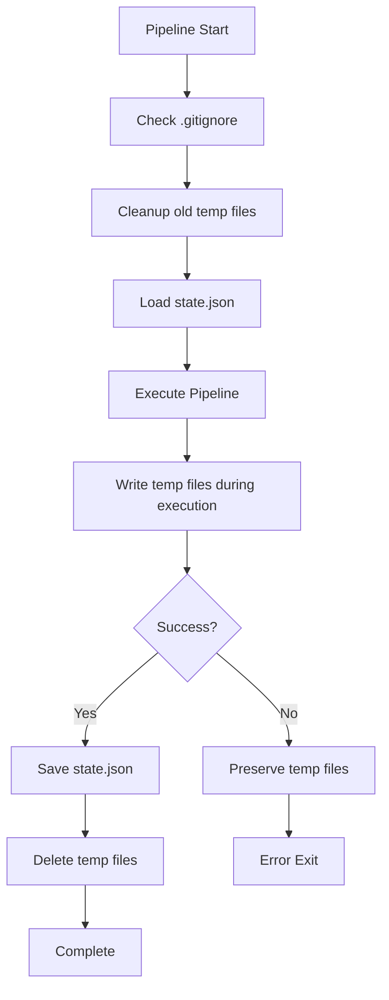

# Caching and State Management: Temp Files, State Persistence, and Cleanup

## Overview

Implement hybrid caching system: temporary files for intermediate results during pipeline execution, state file for persisting user preferences and metadata across runs, and automatic cleanup. This ticket enables error recovery and improves user experience.

## Scope

**Included:**

- .ruley/ directory management (file:src/utils/cache.rs)
- Temporary file creation and cleanup
- State file persistence (state.json)
- State file versioning and migration
- .gitignore auto-management
- Old temp file cleanup (24-hour threshold)

**Explicitly Out:**

- Progress bars (Ticket 7)
- Error handling UI (Ticket 7)

## Acceptance Criteria

### 1. .ruley/ Directory Structure

✅ Create directory structure:

```
.ruley/
├── state.json           # Persistent state across runs
├── files.json           # Temp: Scanned file list
├── compressed.txt       # Temp: Compressed codebase
├── chunk-0.json         # Temp: Chunk 0 analysis
├── chunk-1.json         # Temp: Chunk 1 analysis
└── ...
```

✅ Create .ruley/ directory on first run if it doesn't exist ✅ Set appropriate permissions (user read/write only)

### 2. Temporary File Management

✅ Implement temp file creation (file:src/utils/cache.rs):

```rust
pub struct TempFileManager {
    ruley_dir: PathBuf,
}

impl TempFileManager {
    pub fn new(project_root: &Path) -> Result<Self>;

    pub async fn write_scanned_files(&self, files: &[FileEntry]) -> Result<PathBuf>;

    pub async fn write_compressed_codebase(&self, codebase: &CompressedCodebase)
    -> Result<PathBuf>;

    pub async fn write_chunk_result(
        &self,
        chunk_id: usize,
        result: &ChunkResult,
    ) -> Result<PathBuf>;

    pub async fn read_chunk_result(&self, chunk_id: usize) -> Result<ChunkResult>;
}
```

✅ Temp files are JSON or text format (human-readable for debugging) ✅ Temp files include timestamp in metadata

### 3. State File Schema

✅ Define state structure (file:src/utils/state.rs):

```rust
#[derive(Serialize, Deserialize)]
pub struct State {
    pub version: String, // "1.0.0"
    pub last_run: DateTime<Utc>,
    pub user_selections: UserSelections,
    pub output_files: Vec<PathBuf>,
    pub cost_spent: f32,
    pub token_count: usize,
    pub compression_ratio: f32,
}

#[derive(Serialize, Deserialize)]
pub struct UserSelections {
    pub file_conflict_action: Option<ConflictAction>,
    pub apply_to_all: bool,
}

#[derive(Serialize, Deserialize)]
pub enum ConflictAction {
    Overwrite,
    SmartMerge,
    Skip,
}
```

✅ State file location: `.ruley/state.json` ✅ JSON format for human readability

### 4. State Persistence

✅ Implement state management:

```rust
pub async fn save_state(state: &State, ruley_dir: &Path) -> Result<()>;

pub async fn load_state(ruley_dir: &Path) -> Result<Option<State>>;
```

✅ Save state on successful completion ✅ Load state on startup (if exists) ✅ Handle missing or corrupted state gracefully (use defaults, log warning)

### 5. State Versioning

✅ Implement version migration:

```rust
pub fn migrate_state(
    old_state: serde_json::Value,
    from_version: &str,
    to_version: &str,
) -> Result<State>
```

✅ Support migration from v1.0.0 to future versions ✅ Log migration actions ✅ Preserve user data during migration

### 6. Cleanup Logic

✅ Implement cleanup (file:src/utils/cache.rs):

```rust
pub async fn cleanup_temp_files(ruley_dir: &Path, preserve_state: bool) -> Result<()>;

pub async fn cleanup_old_temp_files(ruley_dir: &Path, age_threshold: Duration) -> Result<()>;
```

✅ On successful completion:

- Delete all temp files (files.json, compressed.txt, chunk-\*.json)
- Preserve state.json
- Log cleanup actions

✅ On error:

- Preserve all temp files for debugging
- Log preservation message

✅ On startup:

- Delete temp files older than 24 hours
- Preserve state.json regardless of age

### 7. .gitignore Management

✅ Implement .gitignore auto-management:

```rust
pub async fn ensure_gitignore_entry(
    project_root: &Path,
) -> Result<()>
```

✅ Check if .gitignore exists ✅ Check if .ruley/ entry exists ✅ If not, append `.ruley/` to .gitignore ✅ Create .gitignore if it doesn't exist ✅ Log action taken

### 8. Integration with Pipeline

✅ Orchestrator uses cache manager:

```rust
// On startup
let cache = TempFileManager::new(&config.path)?;
cache.cleanup_old_temp_files(Duration::from_secs(24 * 3600)).await?;
cache.ensure_gitignore_entry(&config.path).await?;

// Load previous state
let prev_state = state::load_state(&cache.ruley_dir).await?;

// During pipeline
let files_path = cache.write_scanned_files(&files).await?;
ctx.temp_files.scanned_files = Some(files_path);

let compressed_path = cache.write_compressed_codebase(&codebase).await?;
ctx.temp_files.compressed_code = Some(compressed_path);

// On success
let state = State {
    version: "1.0.0".to_string(),
    last_run: Utc::now(),
    user_selections: ctx.user_selections.clone(),
    output_files: ctx.output_files.clone(),
    cost_spent: ctx.total_cost,
    token_count: codebase.total_tokens,
    compression_ratio: codebase.compression_ratio,
};

state::save_state(&state, &cache.ruley_dir).await?;
cache.cleanup_temp_files(&cache.ruley_dir, false).await?;

// On error
// Temp files preserved automatically (no cleanup call)
```

### 9. Error Recovery

✅ If ruley crashes mid-run:

- Temp files remain in .ruley/
- User can inspect files for debugging
- Next run cleans up old temp files (24-hour threshold)

✅ If state file is corrupted:

- Log warning
- Use default state
- Continue execution

## Technical References

- **Core Flows**: Flow 2 (Basic Usage), Flow 9 (Incremental Updates)
- **Technical Plan**: Section "Architectural Approach" → "Hybrid Caching Strategy", "Cache Management"
- **AGENTS.md**: Error Handling, File I/O sections

## Dependencies

- **Ticket 1**: Foundation (Context, Config)
- **Ticket 2**: Input Processing (FileEntry, CompressedCodebase)
- **Ticket 3**: LLM Integration (ChunkResult)

## Testing

- Unit tests for temp file creation and reading
- Unit tests for state serialization/deserialization
- Unit tests for state versioning and migration
- Unit tests for cleanup logic (preserve vs delete)
- Integration test: Create temp files, verify cleanup on success
- Integration test: Simulate error, verify temp files preserved
- Integration test: Old temp file cleanup (mock old timestamps)
- Integration test: .gitignore entry creation


