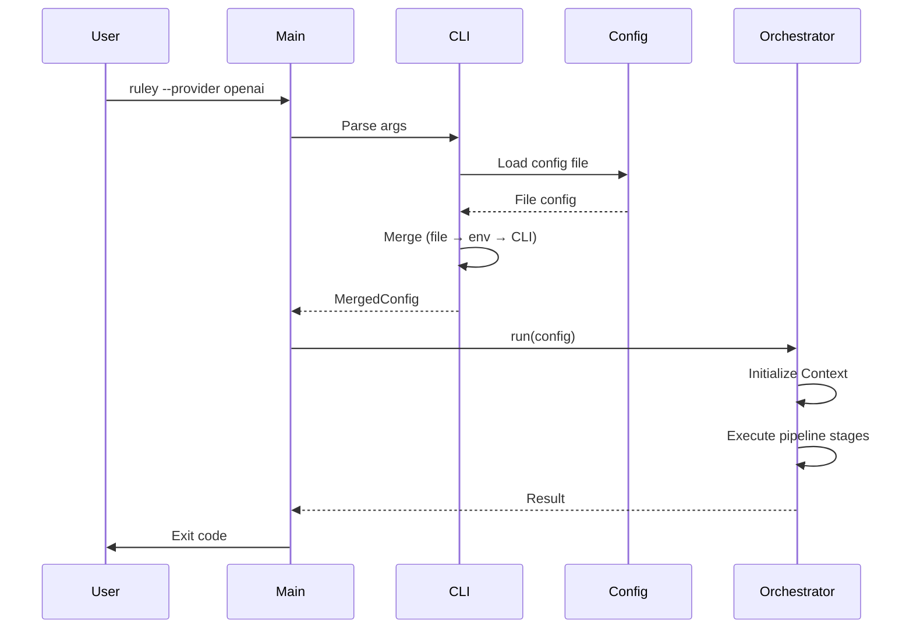

# Foundation: CLI, Configuration, and Pipeline Orchestration

## Overview

Implement the foundational infrastructure for ruley: command-line interface, three-tier configuration system, and context-driven pipeline orchestration. This ticket establishes the skeleton that all other components will plug into.

## Scope

**Included:**

- CLI argument parsing with clap (file:src/cli/args.rs)
- Three-tier configuration system (CLI → env → file) using `config` crate
- Config file discovery (current dir → git root → user config via `dirs` crate)
- Context object and pipeline orchestration (file:src/lib.rs)
- Basic error types with thiserror and anyhow (file:src/utils/error.rs)
- Main entry point (file:src/main.rs)

**Explicitly Out:**

- LLM integration (Ticket 3)
- File scanning and compression (Ticket 2)
- Output formatting (Ticket 5)
- Progress bars (Ticket 7)

## Acceptance Criteria

### 1. CLI Argument Parsing

✅ Implement clap v4 argument structure with:

- `path`: Repository path (default: ".")
- `--provider`: LLM provider (default: "anthropic")
- `--model`: Model name (optional)
- `--format`: Output formats, comma-separated (default: "cursor")
- `--output`: Custom output path (optional)
- `--compress`: Enable tree-sitter compression (flag)
- `--no-confirm`: Skip cost confirmation (flag)
- `--dry-run`: Preview without LLM calls (flag)
- `--repomix-file`: Path to existing repomix file (optional)
- `--description`: Custom focus area (optional)
- `--include`: Include patterns (multiple)
- `--exclude`: Exclude patterns (multiple)
- `--verbose`: Detailed error output (flag)
- `--config`: Custom config file path (optional)

✅ All flags support environment variables via `#[arg(env = "RULEY_*")]`

### 2. Configuration System

✅ Implement three-tier configuration with proper precedence:

1. **Config file** (lowest): Load via `config` crate, support TOML format
2. **Environment variables** (middle): Automatically read by clap
3. **CLI flags** (highest): Override all other sources

✅ Config file discovery logic:

```rust
// Search order:
1. Explicit path from --config flag
2. ./ruley.toml (current directory)
3. Walk up to git root, check each parent for ruley.toml
4. ~/.config/ruley/config.toml (user config via dirs crate)
```

✅ Config file structure (file:src/cli/config.rs):

```toml
[general]
provider = "anthropic"
model = "claude-sonnet-4-5-20250929"
format = ["cursor", "claude"]
compress = true
no_confirm = false

[chunking]
chunk_size = 100000
overlap_size = 10000

[include]
patterns = ["**/*.ts", "**/*.tsx"]

[exclude]
patterns = ["**/node_modules/**", "**/dist/**"]
```

### 3. Context Object

✅ Define Context structure (file:src/lib.rs):

```rust
pub struct Context {
    pub config: MergedConfig,
    pub stage: PipelineStage,
    pub temp_files: TempFileRefs,
    pub progress: ProgressTracker,
}

pub enum PipelineStage {
    Init,
    Scanning { files_found: usize },
    Compressing { files_processed: usize, ratio: f32 },
    Analyzing { chunks: usize, current_chunk: usize },
    Formatting { formats: Vec<String> },
    Writing { files_written: Vec<PathBuf> },
    Complete,
}
```

### 4. Pipeline Orchestration

✅ Implement `run()` function in src/lib.rs:

```rust
pub async fn run(config: MergedConfig) -> Result<()> {
    let mut ctx = Context::new(config);

    // Stage 1: Initialize
    ctx.stage = PipelineStage::Init;

    // Stage 2: Input source selection (stub for now)
    // if config.repomix_file.is_some() { ... }
    // else { ... }

    // Stage 3-9: Placeholder for other stages
    // Will be implemented in other tickets

    // Stage 10: Cleanup
    cleanup_temp_files(&ctx)?;

    Ok(())
}
```

✅ Pipeline stages are clearly defined and documented\
✅ Each stage updates Context appropriately\
✅ Error handling with contextual messages using anyhow

### 5. Error Handling

✅ Define RuleyError enum with thiserror (file:src/utils/error.rs):

```rust
#[derive(Debug, thiserror::Error)]
pub enum RuleyError {
    #[error("Configuration error: {0}")]
    Config(String),

    #[error("File system error: {0}")]
    FileSystem(String),

    #[error("LLM provider error: {0}")]
    LlmProvider(String),
    // ... other variants
}
```

✅ Use anyhow::Result for internal functions\
✅ Convert between error types using From implementations

### 6. Integration

✅ Main function (file:src/main.rs) orchestrates:

1. Parse CLI args
2. Load and merge config
3. Call run() with merged config
4. Handle errors and exit codes

✅ Dry-run mode works (shows config, exits without processing)

## Technical References

- **Epic Brief**: spec:13ef48e4-2ef3-400c-904c-014c56a50b31/a124c81c-c747-45e6-8e1a-2c7258b7e516
- **Core Flows**: Flow 1 (First-Time User), Flow 5 (Configuration File Usage)
- **Technical Plan**: Section "Architectural Approach" → "Pipeline Orchestration", "Configuration System"
- **AGENTS.md**: Configuration Management, Error Handling, CLI Design sections

## Dependencies

None - this is the foundational ticket

## Testing

- Unit tests for config merging with different precedence scenarios
- Unit tests for config file discovery logic
- Integration test: `ruley --dry-run` shows merged config
- Integration test: Config file overrides work correctly
- Integration test: Environment variables override config file
- Integration test: CLI flags override everything


