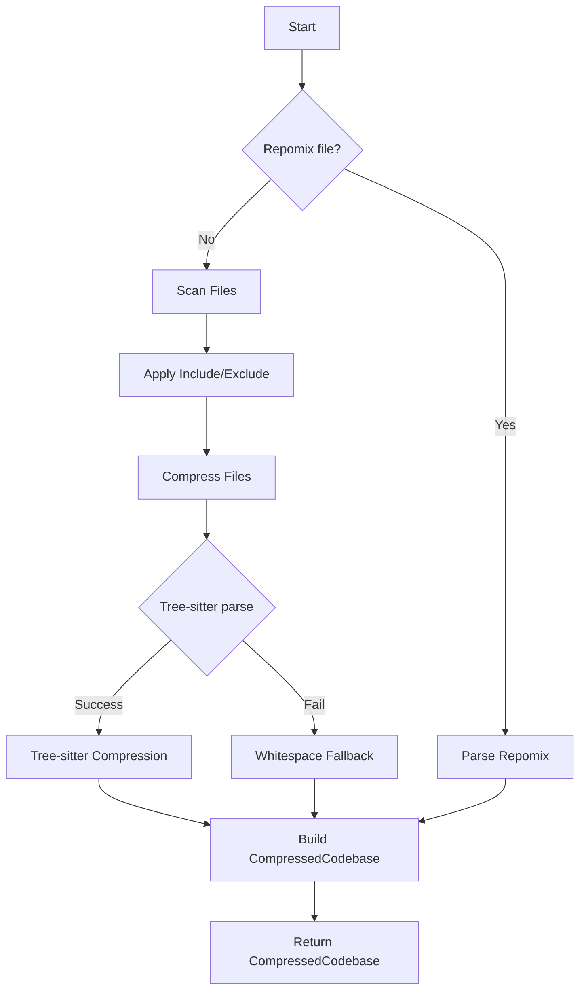

# Input Processing: File Scanning, Compression, and Repomix Support

## Overview

Implement the input processing layer: file scanning with gitignore support, tree-sitter compression with whitespace fallback, and repomix file parsing. This ticket produces the `CompressedCodebase` that feeds into LLM analysis.

## Scope

**Included:**

- File walker with gitignore support (file:src/packer/walker.rs)
- Include/exclude pattern matching using `ignore` crate (file:src/packer/gitignore.rs)
- Tree-sitter compression for TypeScript, Python, Rust, Go (file:src/packer/compress.rs)
- Whitespace compression fallback
- Repomix file parser (file:src/packer/repomix.rs) - markdown, XML, JSON formats
- Git repository detection for config discovery (file:src/packer/git.rs)
- CompressedCodebase data structure

**Explicitly Out:**

- Token counting (Ticket 3 - needs provider-specific tokenizers)
- LLM integration (Ticket 3)
- Progress bars (Ticket 7)
- Caching to disk (Ticket 6)

## Acceptance Criteria

### 1. File Walker

✅ Implement directory traversal (file:src/packer/walker.rs):

```rust
pub async fn scan_files(
    path: &Path,
    patterns: &Patterns,
    ctx: &mut Context,
) -> Result<Vec<FileEntry>>
```

✅ Respects .gitignore automatically using `ignore` crate ✅ Applies include/exclude patterns (gitignore syntax) ✅ Returns file list with metadata (path, size, language) ✅ Handles symlinks and permission errors gracefully

### 2. Tree-sitter Compression

✅ Implement compression (file:src/packer/compress.rs):

```rust
pub async fn compress_codebase(
    files: Vec<FileEntry>,
    ctx: &mut Context,
) -> Result<CompressedCodebase>
```

✅ Supports four languages via feature flags:

- TypeScript (feature: `compression-typescript`)
- Python (feature: `compression-python`)
- Rust (feature: `compression-rust`)
- Go (feature: `compression-go`)

✅ Compression strategy:

1. Parse file with tree-sitter
2. Extract: function signatures, type definitions, imports, comments
3. Remove: function bodies, implementation details
4. Target: ~70% token reduction

✅ Fallback to whitespace compression if tree-sitter fails:

- Remove extra whitespace, blank lines
- Preserve structure and indentation
- Target: ~30-40% reduction
- Log warning about fallback

### 3. CompressedCodebase Structure

✅ Define data structure:

```rust
pub struct CompressedCodebase {
    pub files: Vec<CompressedFile>,
    pub total_tokens: usize, // Calculated in Ticket 3
    pub compression_ratio: f32,
    pub metadata: CodebaseMetadata,
}

pub struct CompressedFile {
    pub path: String,
    pub content: String,
    pub tokens: usize, // Calculated in Ticket 3
    pub language: Option<Language>,
    pub compression_method: CompressionMethod,
}

pub enum CompressionMethod {
    TreeSitter { ratio: f32 },
    Whitespace { ratio: f32 },
    None,
}
```

### 4. Repomix Parser

✅ Implement parser (file:src/packer/repomix.rs):

```rust
pub async fn parse_repomix(
    file_path: &Path,
    ctx: &mut Context,
) -> Result<CompressedCodebase>
```

✅ Supports three formats:

- **Markdown**: Parse code blocks with file paths
- **XML**: Parse structured repomix XML format
- **JSON**: Parse JSON array of file objects

✅ Fallback strategy:

- If parsing fails, pass entire file content unparsed
- Set compression_method to None
- Log warning about unparsed format

✅ Extract metadata if available (file count, languages)

### 5. Git Repository Detection

✅ Implement git root finder (file:src/packer/git.rs):

```rust
pub fn find_git_root(start_path: &Path) -> Option<PathBuf>
```

✅ Walk up directory tree looking for `.git` directory ✅ Used by config discovery logic (Ticket 1) ✅ Returns None if no git repository found

### 6. Integration with Pipeline

✅ Orchestrator (file:src/lib.rs) calls appropriate function:

```rust
let codebase = if let Some(repomix_path) = &config.repomix_file {
    repomix::parse_repomix(repomix_path, &mut ctx).await?
} else {
    let files = walker::scan_files(&config.path, &config.patterns, &mut ctx).await?;
    compress::compress_codebase(files, &mut ctx).await?
};
```

✅ Context updated with stage information ✅ Errors propagated with context

## Technical References

- **Core Flows**: Flow 2 (Basic Usage) steps 2-4, Flow 10 (Using Existing Repomix File)
- **Technical Plan**: Section "Component Architecture" → "Packer Module", "Repomix Module"
- **AGENTS.md**: Async Patterns, Error Handling sections

## Dependencies

- **Ticket 1**: Foundation (Context, Config, Pipeline)

## Testing

- Unit tests for tree-sitter compression (verify ~70% reduction)
- Unit tests for whitespace fallback (verify ~30-40% reduction)
- Unit tests for repomix parsing (markdown, XML, JSON)
- Unit tests for gitignore pattern matching
- Integration test: Scan real codebase, verify file discovery
- Integration test: Compress TypeScript project, verify output
- Integration test: Parse repomix file, verify CompressedCodebase
- Integration test: Fallback to whitespace on parse error


