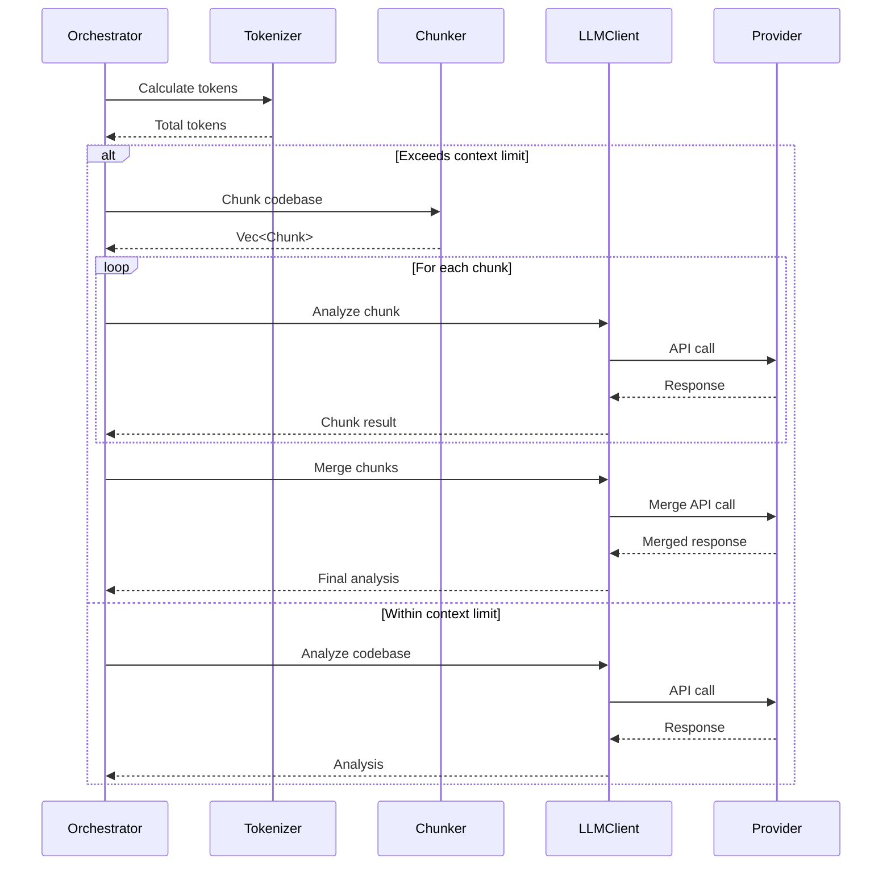

# LLM Integration: Provider Abstraction, Chunking, and Retry Logic

## Overview

Implement LLM integration using the external `llm` crate, including provider-specific tokenization, smart chunking for large codebases, and automatic retry with exponential backoff. This ticket enables communication with Anthropic Claude and OpenAI GPT.

## Scope

**Included:**

- Integration with external `llm` crate v0.1.x (file:src/llm/client.rs)
- Provider-specific token counting (tiktoken for OpenAI, Anthropic tokenizer) (file:src/llm/tokenizer.rs)
- Token-based chunking with configurable overlap (file:src/llm/chunker.rs)
- Automatic retry with exponential backoff
- Cost calculation and tracking
- Chunk merge logic (LLM-based synthesis)

**Explicitly Out:**

- Prompt generation (Ticket 4)
- Output formatting (Ticket 5)
- Progress bars (Ticket 7)
- Cost estimation UI (Ticket 7)

## Acceptance Criteria

### 1. LLM Client Integration

✅ Verify `llm` crate v0.1.x supports required features:

- Anthropic Claude API
- OpenAI GPT API
- Streaming responses
- Error handling
- Custom headers/options

✅ Implement client wrapper (file:src/llm/client.rs):

```rust
pub struct LlmClient {
    provider: Box<dyn LlmProvider>,  // From llm crate
    retry_config: RetryConfig,
}

pub async fn complete(
    &self,
    prompt: &str,
    options: &CompletionOptions,
) -> Result<String>
```

✅ Support both providers:

- Anthropic: claude-sonnet-4-5-20250929 (default)
- OpenAI: gpt-4-turbo, gpt-4o

✅ Handle API key loading from config (env vars, config file, CLI)

### 2. Token Counting

✅ Implement provider-specific tokenizers (file:src/llm/tokenizer.rs):

```rust
pub trait Tokenizer {
    fn count_tokens(&self, text: &str) -> usize;
}

pub struct TiktokenTokenizer; // For OpenAI
pub struct AnthropicTokenizer; // For Anthropic
```

✅ Use tiktoken-rs for OpenAI (cl100k_base encoding) ✅ Use Anthropic SDK tokenizer for Claude ✅ Calculate tokens for CompressedCodebase:

```rust
pub fn calculate_tokens(
    codebase: &mut CompressedCodebase,
    tokenizer: &dyn Tokenizer,
) -> Result<()>
```

### 3. Chunking Logic

✅ Implement token-based chunker (file:src/llm/chunker.rs):

```rust
pub struct ChunkConfig {
    pub chunk_size: usize,      // Default: 100,000 tokens
    pub overlap_size: usize,    // Default: 10,000 tokens (10%)
}

pub fn chunk_codebase(
    codebase: &CompressedCodebase,
    config: &ChunkConfig,
    tokenizer: &dyn Tokenizer,
) -> Result<Vec<Chunk>>
```

✅ Chunking strategy:

1. Calculate total tokens using provider-specific tokenizer
2. If exceeds context limit (e.g., 200K for Claude), split into chunks
3. Use tiktoken library to split at token boundaries
4. Add configurable overlap between chunks (default: 10%)
5. Return Vec<Chunk> with content and metadata

✅ Each chunk includes:

- Chunk ID
- Content (may span multiple files)
- Token count
- Overlap token count

### 4. Retry Logic

✅ Implement exponential backoff (file:src/llm/client.rs):

```rust
pub struct RetryConfig {
    pub max_retries: usize,      // Default: 3
    pub initial_delay: Duration, // Default: 1s
    pub max_delay: Duration,     // Default: 60s
    pub jitter: bool,            // Default: true
}
```

✅ Retry on:

- HTTP 429 (rate limit)
- HTTP 500-504 (server errors)
- Network timeouts

✅ Do NOT retry on:

- HTTP 400, 401, 403 (client errors)
- Context length exceeded (trigger chunking instead)

✅ Exponential backoff: 1s → 2s → 4s → 8s (with jitter)

### 5. Chunk Processing and Merge

✅ Implement chunked analysis:

```rust
pub async fn analyze_chunked(
    chunks: Vec<Chunk>,
    prompt_template: &str,
    client: &LlmClient,
    ctx: &mut Context,
) -> Result<String>
```

✅ Process each chunk sequentially:

1. Build prompt for chunk (include chunk ID, total chunks)
2. Call LLM with chunk content
3. Store chunk result
4. Update progress (handled in Ticket 7)

✅ After all chunks complete, make merge call:

```rust
pub async fn merge_chunk_results(
    chunk_results: Vec<ChunkResult>,
    client: &LlmClient,
) -> Result<String>
```

✅ Merge prompt includes all chunk analyses ✅ LLM synthesizes into coherent rules (deduplicates, combines insights)

### 6. Cost Tracking

✅ Calculate costs based on provider pricing:

```rust
pub struct CostCalculator {
    provider: Provider,
}

pub fn calculate_cost(
    &self,
    input_tokens: usize,
    output_tokens: usize,
) -> f32
```

✅ Track costs per operation:

- Initial analysis
- Each chunk analysis
- Merge call
- Format refinements

✅ Return total cost in Result metadata

### 7. Integration with Pipeline

✅ Orchestrator calls LLM module:

```rust
// Calculate tokens
let tokenizer = get_tokenizer(&config.provider);
calculate_tokens(&mut codebase, &tokenizer)?;

// Check if chunking needed
let chunks = if codebase.total_tokens > context_limit {
    chunker::chunk_codebase(&codebase, &config.chunking, &tokenizer)?
} else {
    vec![Chunk::from_codebase(&codebase)]
};

// Analyze (with or without chunking)
let analysis = if chunks.len() > 1 {
    llm::analyze_chunked(chunks, prompt, &client, &mut ctx).await?
} else {
    llm::analyze(&chunks[0].content, prompt, &client).await?
};
```

## Technical References

- **Core Flows**: Flow 2 (Basic Usage) steps 5-6, Technical Clarifications → "Context Limit Handling", "Token Counting"
- **Technical Plan**: Section "Component Architecture" → "LLM Module", "Chunking Algorithm", "Retry Logic"
- **AGENTS.md**: Async Patterns, Error Handling, Retry Strategy sections

## Dependencies

- **Ticket 1**: Foundation (Context, Config, Error types)
- **Ticket 2**: Input Processing (CompressedCodebase)

## Testing

- Unit tests for token counting (verify accuracy for both providers)
- Unit tests for chunking logic (verify overlap, boundaries)
- Unit tests for retry logic (mock rate limits, verify backoff)
- Unit tests for cost calculation (verify pricing accuracy)
- Integration test: Analyze small codebase (no chunking)
- Integration test: Analyze large codebase (with chunking and merge)
- Integration test: Retry on rate limit (mock 429 response)
- Integration test: Fail on client error (mock 401 response)


