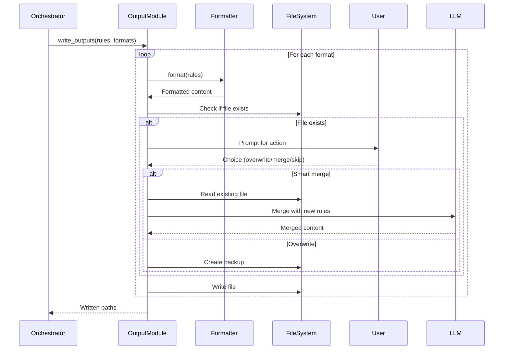

# Output Handling: Formatters, File Writing, and Conflict Resolution

## Overview

Implement output handling: format-specific file writers for Cursor, Claude, and Copilot, conflict resolution for existing files (overwrite/merge/skip), and backup creation. This ticket delivers the final user-facing output.

## Scope

**Included:**

- OutputFormatter trait definition (file:src/output/mod.rs)
- Cursor formatter (.mdc files) (file:src/output/cursor.rs)
- Claude formatter (CLAUDE.md) (file:src/output/claude.rs)
- Copilot formatter (.github/copilot-instructions.md) (file:src/output/copilot.rs)
- File conflict detection and resolution (overwrite/merge/skip)
- Backup file creation (.bak files)
- Convention-based output paths with --output override

**Explicitly Out:**

- LLM calls for smart merge (Ticket 3 handles LLM, Ticket 4 handles prompts)
- Progress bars (Ticket 7)
- State file persistence (Ticket 6)

## Acceptance Criteria

### 1. OutputFormatter Trait

✅ Define trait (file:src/output/mod.rs):

```rust
pub trait OutputFormatter {
    /// Format rules for this output type
    fn format(&self, rules: &GeneratedRules) -> Result<String>;

    /// Default output path for this format
    fn default_path(&self) -> PathBuf;

    /// Whether this format supports rule types
    fn supports_rule_types(&self) -> bool;
}
```

✅ Implement for three formats:

- CursorFormatter
- ClaudeFormatter
- CopilotFormatter

### 2. Cursor Formatter

✅ Implement Cursor .mdc format (file:src/output/cursor.rs):

```rust
pub struct CursorFormatter {
    pub rule_type: RuleType,
}

impl OutputFormatter for CursorFormatter {
    fn format(&self, rules: &GeneratedRules) -> Result<String> {
        // Format as Markdown with YAML frontmatter
    }

    fn default_path(&self) -> PathBuf {
        PathBuf::from(".cursor/rules/project.mdc")
    }

    fn supports_rule_types(&self) -> bool {
        true
    }
}
```

✅ Output format:

```markdown
---
title: Project Rules
type: {rule_type}  # Always Apply, Apply Intelligently, etc.
---

# Project Overview

{overview}

## Coding Conventions

{conventions}

## Architecture Patterns

{patterns}

## Examples

{examples}
```

✅ Support all four rule types:

- Always Apply
- Apply Intelligently
- Apply to Specific Files
- Apply Manually

### 3. Claude Formatter

✅ Implement Claude format (file:src/output/claude.rs):

```rust
pub struct ClaudeFormatter;

impl OutputFormatter for ClaudeFormatter {
    fn format(&self, rules: &GeneratedRules) -> Result<String> {
        // Format as structured Markdown
    }

    fn default_path(&self) -> PathBuf {
        PathBuf::from("CLAUDE.md")
    }

    fn supports_rule_types(&self) -> bool {
        false
    }
}
```

✅ Output format:

```markdown
# Claude Project Rules

## Project Context

{context}

## Coding Standards

{standards}

## Architecture

{architecture}

## Best Practices

{best_practices}
```

### 4. Copilot Formatter

✅ Implement Copilot format (file:src/output/copilot.rs):

```rust
pub struct CopilotFormatter;

impl OutputFormatter for CopilotFormatter {
    fn format(&self, rules: &GeneratedRules) -> Result<String> {
        // Format as GitHub Copilot instructions
    }

    fn default_path(&self) -> PathBuf {
        PathBuf::from(".github/copilot-instructions.md")
    }

    fn supports_rule_types(&self) -> bool {
        false
    }
}
```

✅ Output format:

```markdown
# GitHub Copilot Instructions

## Project Guidelines

{guidelines}

## Code Style

{style}

## Patterns to Follow

{patterns}

## Patterns to Avoid

{anti_patterns}
```

### 5. File Writing with Conflict Resolution

✅ Implement file writer (file:src/output/mod.rs):

```rust
pub async fn write_outputs(
    rules: &GeneratedRules,
    formats: &[String],
    config: &OutputConfig,
    ctx: &mut Context,
) -> Result<Vec<PathBuf>>
```

✅ For each format:

1. Get formatter for format
2. Format rules
3. Determine output path (default or --output override)
4. Check if file exists
5. If exists, prompt user for action (see Flow 3)
6. Execute user's choice
7. Write file
8. Return written paths

✅ Conflict resolution options:

```
File exists: .cursor/rules/project.mdc

Choose action:
1. Overwrite (backup existing file to .cursor/rules/project.mdc.bak)
2. Smart merge (use existing rules as context for LLM)
3. Skip this file
4. Apply to all remaining files

Choice [1-4]:
```

✅ User selection handling:

- **Overwrite**: Rename existing to .bak, write new file
- **Smart merge**:
  1. Read existing file
  2. Build smart merge prompt (Ticket 4)
  3. Call LLM (Ticket 3)
  4. Write merged result
- **Skip**: Continue to next format
- **Apply to all**: Remember choice, apply to remaining files without prompting

### 6. Backup Creation

✅ Create backup before overwriting:

```rust
fn create_backup(path: &Path) -> Result<PathBuf> {
    let backup_path = path.with_extension("mdc.bak");
    fs::copy(path, &backup_path)?;
    Ok(backup_path)
}
```

✅ Backup naming: `{original}.bak` (e.g., `project.mdc.bak`) ✅ Overwrite existing backup if present

### 7. Output Path Handling

✅ Support convention-based paths (default):

- Cursor: `.cursor/rules/project.mdc`
- Claude: `CLAUDE.md`
- Copilot: `.github/copilot-instructions.md`

✅ Support --output flag override:

- Single format: Use --output path directly
- Multiple formats: Error (ambiguous which format gets custom path)

✅ Create parent directories if they don't exist

### 8. Integration with Pipeline

✅ Orchestrator calls output module:

```rust
let written_paths = output::write_outputs(
    &rules,
    &config.formats,
    &config.output_config,
    &mut ctx,
).await?;

// Store paths in context for state file (Ticket 6)
ctx.output_files = written_paths;
```

## Technical References

- **Core Flows**: Flow 2 (Basic Usage) step 8, Flow 3 (Existing Files), Flow 6 (Multi-Format Output)
- **Technical Plan**: Section "Component Architecture" → "Output Module"
- **AGENTS.md**: Error Handling, File I/O sections

## Dependencies

- **Ticket 1**: Foundation (Context, Config)
- **Ticket 3**: LLM Integration (for smart merge LLM calls)
- **Ticket 4**: Rule Generation (GeneratedRules structure, smart merge prompts)

## Testing

- Unit tests for each formatter (verify output format)
- Unit tests for backup creation
- Unit tests for path resolution (default vs --output)
- Integration test: Write Cursor format, verify .mdc structure
- Integration test: Write all three formats, verify files created
- Integration test: Overwrite with backup, verify .bak file created
- Integration test: Smart merge, verify LLM called with existing rules
- Integration test: Skip file, verify file not modified


