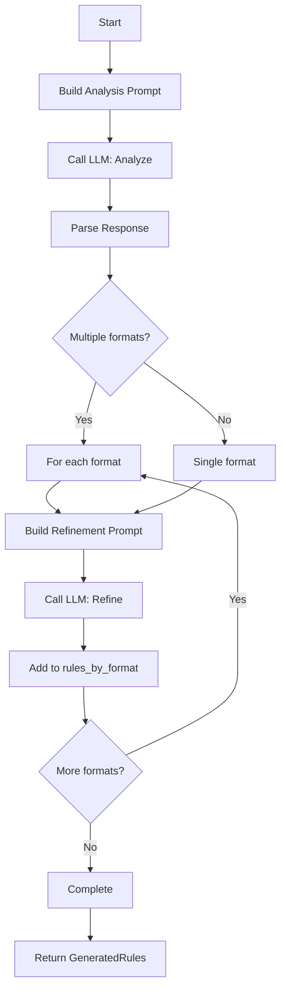

# Rule Generation: Prompts, Parsing, and Format Refinement

## Overview

Implement rule generation logic: prompt templates for analysis and format-specific refinement, LLM response parsing, and smart merge for incremental updates. This ticket bridges LLM responses and output formatters.

## Scope

**Included:**

- Prompt templates for initial analysis (file:src/generator/prompts.rs)
- Prompt templates for format-specific refinement
- Prompt templates for chunk merging
- Prompt templates for smart merge (existing rules + new analysis)
- LLM response parsing into GeneratedRules structure (file:src/generator/rules.rs)
- Focus area integration (--description flag)

**Explicitly Out:**

- LLM API calls (Ticket 3)
- Output file writing (Ticket 5)
- Progress bars (Ticket 7)

## Acceptance Criteria

### 1. Analysis Prompt Template

✅ Implement initial analysis prompt (file:src/generator/prompts.rs):

```rust
pub fn build_analysis_prompt(
    codebase: &CompressedCodebase,
    focus: Option<&str>,
) -> String
```

✅ Prompt structure:

```
You are analyzing a codebase to generate AI IDE rules.

Codebase Overview:
- Files: {file_count}
- Languages: {languages}
- Total tokens: {token_count}

{if focus.is_some()}
Special Focus: {focus}
{endif}

Codebase Content:
{compressed_codebase}

Task:
Analyze this codebase and identify:
1. Coding conventions and style patterns
2. Architecture and design patterns
3. Common libraries and frameworks
4. Testing patterns
5. Documentation standards
6. Error handling patterns
7. Performance considerations

Generate comprehensive rules that will help AI assistants provide
accurate, project-specific suggestions to developers.
```

✅ Include focus area if provided via --description flag ✅ Include metadata (file count, languages, compression ratio)

### 2. Format Refinement Prompts

✅ Implement format-specific refinement prompts:

```rust
pub fn build_refinement_prompt(
    analysis: &str,
    format: &str,
    rule_type: Option<RuleType>,
) -> String
```

✅ Cursor format prompt:

```
Convert the following analysis into Cursor .mdc format.

Analysis:
{analysis}

Format Requirements:
- Use Markdown with YAML frontmatter
- Include rule type: {rule_type} (Always Apply, Apply Intelligently, Apply to Specific Files, Apply Manually)
- Structure: Overview, Conventions, Patterns, Examples
- Be specific and actionable

Output the formatted rules ready to save to .cursor/rules/project.mdc
```

✅ Claude format prompt (similar structure for CLAUDE.md) ✅ Copilot format prompt (similar structure for .github/copilot-instructions.md)

### 3. Chunk Merge Prompt

✅ Implement chunk merge prompt:

```rust
pub fn build_merge_prompt(
    chunk_results: &[ChunkResult],
) -> String
```

✅ Prompt structure:

```
You analyzed a large codebase in {chunk_count} chunks.
Below are the analyses for each chunk.

Chunk 1 Analysis:
{chunk_1_analysis}

Chunk 2 Analysis:
{chunk_2_analysis}

...

Task:
Synthesize these chunk analyses into a single, coherent set of rules.
- Deduplicate overlapping patterns
- Combine related insights
- Maintain comprehensive coverage
- Prioritize most important patterns

Generate the final unified analysis.
```

### 4. Smart Merge Prompt

✅ Implement smart merge prompt (for Flow 9):

```rust
pub fn build_smart_merge_prompt(
    existing_rules: &str,
    new_analysis: &str,
) -> String
```

✅ Prompt structure:

```
The codebase has changed since the last rule generation.

Previous Rules:
{existing_rules}

New Analysis:
{new_analysis}

Task:
Update the rules to reflect the current codebase state.
- Preserve valid existing rules
- Add new patterns discovered in the new analysis
- Update rules that have changed
- Remove rules for deprecated patterns
- Maintain consistency and coherence

Generate the updated rules.
```

### 5. Response Parsing

✅ Implement parser (file:src/generator/rules.rs):

```rust
pub fn parse_analysis_response(
    response: &str,
) -> Result<GeneratedRules>
```

✅ Parse LLM response into structure:

```rust
pub struct GeneratedRules {
    pub analysis: String, // Raw analysis
    pub rules_by_format: HashMap<String, FormattedRules>,
    pub metadata: GenerationMetadata,
}

pub struct FormattedRules {
    pub format: String,
    pub content: String,
    pub rule_type: Option<RuleType>,
}
```

✅ Handle parsing errors gracefully (return raw response if parsing fails) ✅ Extract metadata (timestamp, provider, model, tokens, cost)

### 6. Integration with Pipeline

✅ Orchestrator uses generator module:

```rust
// Build initial analysis prompt
let prompt = prompts::build_analysis_prompt(&codebase, config.description.as_deref());

// Analyze with LLM (Ticket 3)
let analysis = llm::analyze(&prompt, &client).await?;

// Parse response
let mut rules = rules::parse_analysis_response(&analysis)?;

// For each format, refine
for format in &config.formats {
    let refinement_prompt = prompts::build_refinement_prompt(
        &analysis,
        format,
        get_rule_type(format),
    );
    
    let formatted = llm::complete(&refinement_prompt, &client).await?;
    
    rules.rules_by_format.insert(
        format.clone(),
        FormattedRules {
            format: format.clone(),
            content: formatted,
            rule_type: get_rule_type(format),
        },
    );
}
```

### 7. Prompt Template Management

✅ Store base prompts in file:prompts/ directory:

- `base.md`: Base analysis prompt template
- `cursor.md`: Cursor refinement template
- `claude.md`: Claude refinement template
- `copilot.md`: Copilot refinement template

✅ Load templates at runtime, substitute variables ✅ Allow custom templates via config (future enhancement)

## Technical References

- **Core Flows**: Flow 2 (Basic Usage) step 6, Flow 6 (Multi-Format Output), Flow 9 (Incremental Updates)
- **Technical Plan**: Section "Component Architecture" → "Generator Module"
- **AGENTS.md**: Documentation Standards section

## Dependencies

- **Ticket 1**: Foundation (Context, Config)
- **Ticket 2**: Input Processing (CompressedCodebase)
- **Ticket 3**: LLM Integration (for calling LLM with prompts)

## Testing

- Unit tests for prompt generation (verify variable substitution)
- Unit tests for response parsing (verify structure extraction)
- Integration test: Generate analysis prompt, verify format
- Integration test: Generate refinement prompts for all formats
- Integration test: Parse LLM response, verify GeneratedRules structure
- Integration test: Smart merge prompt includes existing rules


