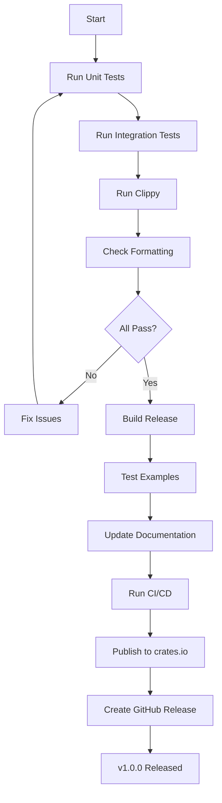

# Testing, Documentation, and CI/CD

## Overview

Implement comprehensive testing, documentation, and CI/CD infrastructure. This ticket ensures ruley is production-ready with quality assurance, clear documentation, and automated release processes.

## Scope

**Included:**

- Integration tests for core flows (file:tests/integration_test.rs)
- Unit tests for critical functionality (inline in modules)
- Documentation (README.md, API docs, examples)
- GitHub Actions CI/CD workflows
- Binary release automation (GoReleaser)
- Homebrew tap setup
- crates.io publishing

**Explicitly Out:**

- Property testing (future enhancement)
- Benchmarks (future enhancement)
- Extensive unit tests for trivial code (per AGENTS.md test proportionality)

## Acceptance Criteria

### 1. Integration Tests

✅ Implement integration tests (file:tests/integration_test.rs):

**Test: Basic Usage (Flow 2)**

```rust
#[tokio::test]
async fn test_basic_usage() {
    // Setup: Create test project with sample files
    // Execute: ruley with mock LLM responses
    // Verify: Output files created with correct content
}
```

**Test: Dry-Run Mode (Flow 4)**

```rust
#[tokio::test]
async fn test_dry_run() {
    // Execute: ruley --dry-run
    // Verify: No LLM calls made, preview displayed
}
```

**Test: Configuration Merging (Flow 5)**

```rust
#[tokio::test]
async fn test_config_precedence() {
    // Setup: Config file, env vars, CLI flags
    // Execute: ruley with all three sources
    // Verify: CLI flags override env vars override config file
}
```

**Test: Multi-Format Output (Flow 6)**

```rust
#[tokio::test]
async fn test_multi_format() {
    // Execute: ruley --format cursor,claude,copilot
    // Verify: All three formats generated correctly
}
```

**Test: Existing Files - Overwrite (Flow 3)**

```rust
#[tokio::test]
async fn test_overwrite_with_backup() {
    // Setup: Existing output file
    // Execute: ruley with overwrite choice
    // Verify: Backup created, new file written
}
```

**Test: Repomix File (Flow 10)**

```rust
#[tokio::test]
async fn test_repomix_input() {
    // Setup: Create repomix file
    // Execute: ruley --repomix-file path/to/file
    // Verify: Rules generated from repomix content
}
```

**Test: Chunking (Large Codebase)**

```rust
#[tokio::test]
async fn test_chunking() {
    // Setup: Large codebase exceeding context limit
    // Execute: ruley with mock LLM
    // Verify: Chunking triggered, merge call made
}
```

**Test: Error Handling (Flow 7)**

```rust
#[tokio::test]
async fn test_rate_limit_error() {
    // Setup: Mock LLM to return 429
    // Execute: ruley
    // Verify: Retry attempted, contextual error displayed
}
```

✅ Use test fixtures (file:tests/fixtures/):

- Sample TypeScript project
- Sample Python project
- Sample repomix files (markdown, XML, JSON)
- Mock LLM responses

✅ Use `assert_cmd` for CLI testing ✅ Use `insta` for snapshot testing of outputs (optional, only for critical outputs)

### 2. Unit Tests

✅ Unit tests for critical functionality (per AGENTS.md test proportionality):

**Config merging** (file:src/cli/config.rs):

- Test precedence: CLI > env > file
- Test config file discovery
- Test invalid config handling

**Token counting** (file:src/llm/tokenizer.rs):

- Test tiktoken accuracy for OpenAI
- Test Anthropic tokenizer accuracy

**Chunking logic** (file:src/llm/chunker.rs):

- Test chunk boundaries
- Test overlap calculation
- Test edge cases (empty codebase, single file)

**Compression** (file:src/packer/compress.rs):

- Test tree-sitter compression ratio (~70%)
- Test whitespace fallback (~30-40%)
- Test parse error handling

**Repomix parsing** (file:src/packer/repomix.rs):

- Test markdown format parsing
- Test XML format parsing
- Test JSON format parsing
- Test unparsed fallback

**State management** (file:src/utils/state.rs):

- Test serialization/deserialization
- Test version migration
- Test corrupted state handling

✅ Keep tests focused and minimal (per AGENTS.md) ✅ Avoid testing trivial operations or framework behavior

### 3. Documentation

✅ Update README.md:

````markdown
# ruley

Automatically generate AI IDE rules from your codebase.

## Features

- Multi-provider LLM support (Anthropic Claude, OpenAI GPT)
- Multi-format output (Cursor, Claude, Copilot)
- Tree-sitter compression (~70% token reduction)
- Smart chunking for large codebases
- Cost estimation and confirmation
- Incremental updates with smart merge

## Installation

### Homebrew (macOS/Linux)
```bash
brew install yourusername/tap/ruley
````

### Cargo

```bash
cargo install ruley
```

### Binary Releases

Download from [GitHub Releases](https://github.com/yourusername/ruley/releases)

## Quick Start

```bash
# Generate rules for your project
cd your-project
ruley

# Specify provider and formats
ruley --provider openai --format cursor,claude

# Preview without LLM calls
ruley --dry-run

# Use existing repomix file
ruley --repomix-file repo.txt
```

## Configuration

Create `ruley.toml` in your project root:

```toml
[general]
provider = "anthropic"
format = ["cursor", "claude"]
compress = true

[include]
patterns = ["src/**/*.ts"]

[exclude]
patterns = ["**/node_modules/**"]
```

## Documentation

- [User Guide](docs/user-guide.md)
- [Configuration Reference](docs/configuration.md)
- [API Documentation](https://docs.rs/ruley)

## License

Apache-2.0

````

✅ Create docs/ directory:
- `user-guide.md`: Comprehensive usage guide
- `configuration.md`: Config file reference
- `architecture.md`: Technical architecture overview

✅ Add rustdoc comments to all public APIs
✅ Update examples/ directory with working examples

### 4. GitHub Actions CI/CD

✅ Create workflow: `.github/workflows/ci.yml`
```yaml
name: CI

on:
  push:
    branches: [main]
  pull_request:

jobs:
  test:
    runs-on: ubuntu-latest
    steps:
      - uses: actions/checkout@v4
      - uses: actions-rust-lang/setup-rust-toolchain@v1
      - uses: actions/cache@v4
        with:
          path: |
            ~/.cargo/registry
            ~/.cargo/git
            target
          key: ${{ runner.os }}-cargo-${{ hashFiles('**/Cargo.lock') }}
      - run: cargo test --all-features
      - run: cargo clippy -- -D warnings
      - run: cargo fmt --check

  build:
    strategy:
      matrix:
        os: [ubuntu-latest, macos-latest, windows-latest]
    runs-on: ${{ matrix.os }}
    steps:
      - uses: actions/checkout@v4
      - uses: actions-rust-lang/setup-rust-toolchain@v1
      - run: cargo build --release
````

✅ Create workflow: `.github/workflows/release.yml`

```yaml
name: Release

on:
  push:
    tags:
      - v*

jobs:
  release:
    runs-on: ubuntu-latest
    steps:
      - uses: actions/checkout@v4
      - uses: goreleaser/goreleaser-action@v5
        with:
          version: latest
          args: release --clean
        env:
          GITHUB_TOKEN: ${{ secrets.GITHUB_TOKEN }}
```

### 5. GoReleaser Configuration

✅ Create `.goreleaser.yml`:

```yaml
project_name: ruley

before:
  hooks:
    - cargo build --release

builds:
  - id: ruley
    binary: ruley
    env:
      - CGO_ENABLED=0
    goos:
      - linux
      - darwin
      - windows
    goarch:
      - amd64
      - arm64

archives:
  - format: tar.gz
    name_template: '{{ .ProjectName }}_{{ .Version }}_{{ .Os }}_{{ .Arch }}'
    format_overrides:
      - goos: windows
        format: zip

checksum:
  name_template: checksums.txt

changelog:
  sort: asc
  filters:
    exclude:
      - '^docs:'
      - '^test:'

brews:
  - name: ruley
    homepage: https://github.com/yourusername/ruley
    description: Automatically generate AI IDE rules from your codebase
    license: Apache-2.0
    repository:
      owner: yourusername
      name: homebrew-tap
```

### 6. Crates.io Publishing

✅ Update Cargo.toml metadata:

```toml
[package]
name = "ruley"
version = "1.0.0"
edition = "2024"
authors = ["Your Name <your.email@example.com>"]
description = "Automatically generate AI IDE rules from your codebase"
license = "Apache-2.0"
repository = "https://github.com/yourusername/ruley"
homepage = "https://github.com/yourusername/ruley"
documentation = "https://docs.rs/ruley"
keywords = ["ai", "ide", "rules", "llm", "codebase"]
categories = ["command-line-utilities", "development-tools"]
readme = "README.md"
```

✅ Publish checklist:

- [ ] All tests passing
- [ ] Documentation complete
- [ ] CHANGELOG.md updated
- [ ] Version bumped
- [ ] `cargo publish --dry-run` succeeds
- [ ] `cargo publish` to crates.io

### 7. Examples

✅ Update examples/ directory:

**Basic usage** (file:examples/basic_usage.rs):

```rust
use ruley::{Config, run};

#[tokio::main]
async fn main() -> Result<(), Box<dyn std::error::Error>> {
    let config = Config::default();
    run(config).await?;
    Ok(())
}
```

**Custom provider** (file:examples/custom_provider.rs):

```rust
// Example of using OpenAI instead of Anthropic
```

✅ Ensure examples compile and run

## Technical References

- **AGENTS.md**: Testing, Documentation, GitHub Actions, Cargo.toml Standards sections
- **Technical Plan**: All sections (comprehensive reference)
- **Core Flows**: All flows (test coverage)

## Dependencies

- **All previous tickets**: This ticket validates the complete implementation

## Testing

- Run all integration tests: `cargo test --test integration_test`
- Run all unit tests: `cargo test`
- Run clippy: `cargo clippy -- -D warnings`
- Run fmt check: `cargo fmt --check`
- Build release: `cargo build --release`
- Test examples: `cargo run --example basic_usage`

## Acceptance

✅ All tests passing (unit + integration) ✅ Zero clippy warnings ✅ Code formatted with rustfmt ✅ Documentation complete and accurate ✅ CI/CD workflows passing ✅ Examples compile and run ✅ README.md updated with installation and usage ✅ Ready for v1.0.0 release


