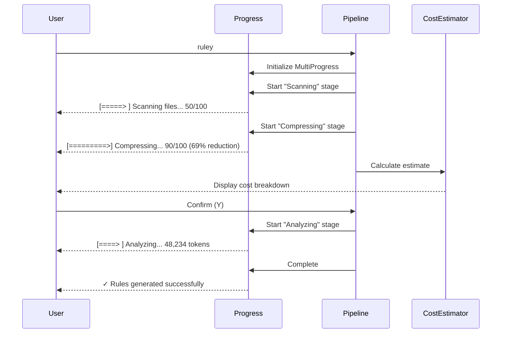

# UX Polish: Progress Bars, Cost Estimation, and Error Messages

## Overview

Implement user experience polish: detailed progress bars with indicatif, cost estimation and confirmation prompts, contextual error messages, and success summaries. This ticket makes ruley transparent, user-friendly, and trustworthy.

## Scope

**Included:**

- Progress bars using indicatif::MultiProgress (file:src/utils/progress.rs)
- Cost estimation display with detailed breakdown
- User confirmation prompts
- Contextual error messages with suggestions
- Success summary with statistics
- Dry-run mode output
- --verbose flag support

**Explicitly Out:**

- Core pipeline logic (Tickets 1-6)
- LLM calls (Ticket 3)
- File writing (Ticket 5)

## Acceptance Criteria

### 1. Progress Bar System

✅ Implement progress manager (file:src/utils/progress.rs):

```rust
pub struct ProgressManager {
    multi: MultiProgress,
    bars: HashMap<String, ProgressBar>,
}

impl ProgressManager {
    pub fn new() -> Self;

    pub fn add_stage(&mut self, name: &str, total: u64) -> ProgressBar;

    pub fn update(&self, stage: &str, current: u64, message: &str);

    pub fn finish(&self, stage: &str, message: &str);
}
```

✅ Create progress bars for each pipeline stage:

- **Scanning**: "Scanning files... {current}/{total} files"
- **Compressing**: "Compressing code... {current}/{total} files ({ratio}% reduction)"
- **Analyzing**: "Analyzing codebase... {tokens} tokens sent"
- **Chunking**: "Analyzing chunk {current}/{total}..."
- **Formatting**: "Generating {format} format..."
- **Writing**: "Writing output files... {current}/{total}"

✅ Use indicatif::MultiProgress for concurrent updates ✅ Each stage gets its own progress bar ✅ Clean console rendering with proper alignment

### 2. Cost Estimation Display

✅ Implement cost estimator (file:src/utils/cost.rs):

```rust
pub fn display_cost_estimate(
    codebase: &CompressedCodebase,
    chunks: &[Chunk],
    formats: &[String],
    provider: &Provider,
) -> Result<()>
```

✅ Display detailed breakdown:

```
Analysis Summary:
├─ Files: 127 files (45 TypeScript, 32 Python, 50 other)
├─ Tokens: 48,234 (before compression: 156,891)
├─ Compression: 69% reduction
├─ Chunks: 1 (within context limit)
├─ Formats: cursor, claude, copilot
└─ Estimated cost: $0.14 (Anthropic Claude Sonnet)

Breakdown:
├─ Initial analysis: $0.12 (48,234 tokens)
└─ Format refinements: $0.02 (3 formats × ~500 tokens each)

Continue? [Y/n]
```

✅ For chunked analysis:

```
Analysis Summary:
├─ Files: 487 files (234 TypeScript, 123 Python, 130 other)
├─ Tokens: 234,567 (before compression: 789,123)
├─ Compression: 70% reduction
├─ Chunks: 3 (exceeds context limit)
└─ Estimated cost: $1.87 (Anthropic Claude Sonnet)

Breakdown:
├─ Chunk 1 analysis: $0.58 (78,189 tokens)
├─ Chunk 2 analysis: $0.58 (78,189 tokens)
├─ Chunk 3 analysis: $0.58 (78,189 tokens)
├─ Merge call: $0.08 (~10,000 tokens)
└─ Format refinements: $0.05 (3 formats × ~500 tokens each)

Note: Large codebase requires chunking. Use --include patterns to reduce scope.

Continue? [Y/n]
```

✅ Respect --no-confirm flag (skip prompt) ✅ Handle user input (Y/n, default: Y)

### 3. Contextual Error Messages

✅ Implement error formatter (file:src/utils/error.rs):

```rust
pub fn format_error(
    error: &RuleyError,
    verbose: bool,
) -> String
```

✅ Error message structure:

```
 Error: {error_type}

 What happened:
 ├─ Stage: {stage}
 ├─ Error: {error_message}
 └─ Context: {additional_context}

 Suggestion:
 • {actionable_suggestion_1}
 • {actionable_suggestion_2}

 For more details, run with --verbose
```

✅ Example error messages:

**Missing API Key:**

```
 Error: API key not found

 What happened:
 ├─ Attempting to connect to Anthropic Claude
 └─ No API key found

 How to fix:
 Set the ANTHROPIC_API_KEY environment variable:

   export ANTHROPIC_API_KEY=sk-...

 Get your key at: https://console.anthropic.com/

 Note: You can also configure via ruley.toml or CLI flags

 Alternative:
 • Use OpenAI with --provider openai (requires OPENAI_API_KEY)
```

**Rate Limit:**

```
 Error: Failed to analyze codebase

 What happened:
 ├─ Stage: Analyzing codebase with Anthropic Claude
 ├─ Error: Rate limit exceeded (429)
 └─ Tokens sent: 48,234

 Suggestion:
 • Wait 60 seconds and try again
 • Or use --provider openai to switch providers
 • Or reduce scope with --include patterns

 For more details, run with --verbose
```

**Context Limit:**

```
 Error: Codebase too large

 What happened:
 ├─ Stage: Analyzing codebase
 ├─ Tokens: 456,789
 └─ Context limit: 200,000 tokens

 Suggestion:
 • Use --include patterns to reduce scope
 • Example: ruley --include "src/**/*.ts"
 • Or use --compress to enable tree-sitter compression

 For more details, run with --verbose
```

✅ With --verbose, include:

- Full error chain
- Stack trace
- Debug information
- Temp file locations

### 4. Success Summary

✅ Implement success formatter:

```rust
pub fn display_success_summary(
    ctx: &Context,
    written_paths: &[PathBuf],
) -> Result<()>
```

✅ Display summary:

```
 ✓ Rules generated successfully

 Output Files:
 ├─ Cursor: .cursor/rules/project.mdc (3.2 KB)
 ├─ Claude: CLAUDE.md (2.8 KB)
 └─ Copilot: .github/copilot-instructions.md (2.1 KB)

 Statistics:
 ├─ Files analyzed: 127
 ├─ Tokens processed: 48,234
 ├─ Compression: 69% reduction
 ├─ Actual cost: $0.14
 └─ Time: 12.3s

 Next Steps:
 • Restart your AI IDE to load the new rules
 • Test AI suggestions in your codebase
 • Re-run ruley when conventions change
```

✅ Show actual cost vs estimated cost ✅ Show time elapsed ✅ Show file sizes

### 5. Dry-Run Mode Output

✅ Implement dry-run display:

```rust
pub fn display_dry_run_summary(
    codebase: &CompressedCodebase,
    formats: &[String],
) -> Result<()>
```

✅ Display preview:

```
 Dry Run - No LLM calls will be made

 Files to be analyzed:
 ├─ TypeScript (45 files, 12,345 tokens)
 │  ├─ src/main.ts (234 tokens)
 │  ├─ src/lib.ts (189 tokens)
 │  └─ ... (43 more files)
 ├─ Python (32 files, 8,901 tokens)
 │  └─ ...
 └─ Other (50 files, 26,988 tokens)

 Total: 127 files, 48,234 tokens
 Compression: 69% reduction (from 156,891 tokens)
 Estimated cost: $0.14

 Output formats: cursor, claude, copilot
 Output locations:
 ├─ .cursor/rules/project.mdc
 ├─ CLAUDE.md
 └─ .github/copilot-instructions.md
```

### 6. Integration with Pipeline

✅ Orchestrator uses progress manager:

```rust
let mut progress = ProgressManager::new();

// Stage 1: Scanning
let scan_bar = progress.add_stage("scan", file_count);
// ... update during scanning
progress.finish("scan", "Scanned 127 files");

// Stage 2: Compressing
let compress_bar = progress.add_stage("compress", file_count);
// ... update during compression
progress.finish("compress", "Compressed 127 files (69% reduction)");

// Stage 3: Cost estimation
display_cost_estimate(&codebase, &chunks, &config.formats, &config.provider)?;
if !config.no_confirm {
    let confirmed = prompt_user("Continue? [Y/n]")?;
    if !confirmed { return Ok(()); }
}

// Stage 4: Analyzing
let analyze_bar = progress.add_stage("analyze", chunks.len());
// ... update during analysis
progress.finish("analyze", "Analysis complete");

// ... other stages

// Success
display_success_summary(&ctx, &written_paths)?;
```

✅ Errors use contextual formatter:

```rust
if let Err(e) = run(config).await {
    let error_msg = format_error(&e, config.verbose);
    eprintln!("{}", error_msg);
    std::process::exit(1);
}
```

## Technical References

- **Core Flows**: Flow 2 (Basic Usage) steps 3-5, 9; Flow 4 (Dry-Run Mode); Flow 7 (Error Handling)
- **Technical Plan**: Section "Architectural Approach" → "Progress Reporting"
- **AGENTS.md**: CLI Design, Error Handling sections

## Dependencies

- **Ticket 1**: Foundation (Context, Config, Error types)
- **Ticket 2**: Input Processing (CompressedCodebase)
- **Ticket 3**: LLM Integration (cost calculation)
- **Ticket 5**: Output Handling (written paths)

## Testing

- Unit tests for cost calculation (verify accuracy)
- Unit tests for error formatting (verify structure)
- Integration test: Run with --dry-run, verify output
- Integration test: Trigger rate limit, verify error message
- Integration test: Complete successful run, verify summary
- Integration test: Run with --verbose, verify detailed errors
- Manual test: Verify progress bars render correctly in terminal


