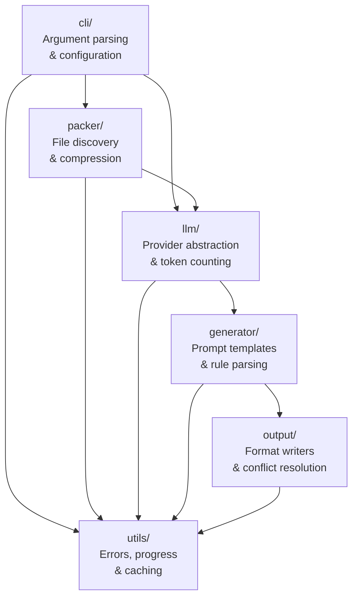
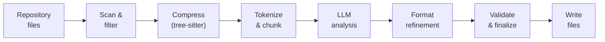

# Architecture Overview

[TOC]

ruley is a single-crate Rust CLI tool organized into focused modules. This chapter describes the high-level architecture, module responsibilities, and design principles.

## Module Map

## Module Responsibilities

| Module       | Purpose                                                                             |
| ------------ | ----------------------------------------------------------------------------------- |
| `cli/`       | Command-line interface with clap argument parsing, config file loading and merging  |
| `packer/`    | Repository scanning, file discovery, gitignore handling, tree-sitter compression    |
| `llm/`       | Multi-provider LLM integration, tokenization, chunking, cost calculation            |
| `generator/` | Analysis and refinement prompt templates, response parsing, rule structures         |
| `output/`    | Multi-format file writers, conflict resolution, smart-merge                         |
| `utils/`     | Shared utilities: error types, progress bars, caching, state management, validation |

## Design Principles

### Provider-Agnostic LLM Interface

All LLM providers implement the `LLMProvider` trait, which defines a standard interface for completions. The `LLMClient` wraps a provider and handles retry logic. New providers can be added by implementing the trait and gating behind a Cargo feature flag.

### Format-Agnostic Rule Generation

The pipeline performs a single LLM analysis pass, then generates format-specific rules through lightweight refinement calls. The `GeneratedRules` structure holds format-independent analysis results and per-format `FormattedRules`. This means adding a new output format requires only a new refinement prompt and writer -- no changes to the analysis pipeline.

### Token-Efficient Processing

ruley minimizes LLM costs through:

- **Tree-sitter compression**: AST-based extraction reduces token count by ~70%
- **Accurate counting**: Native tiktoken tokenization matches provider billing
- **Intelligent chunking**: Large codebases are split at logical boundaries
- **Cost transparency**: Estimates are shown before any LLM calls

### Local-First Design

The scanning, compression, and output stages run entirely locally without network access. Only the analysis and refinement stages call external LLM APIs. When using Ollama, the entire pipeline runs on your machine.

## Data Flow

1. **Repository files** are scanned respecting `.gitignore` rules
2. Source files are **compressed** via tree-sitter (if enabled) to reduce token count
3. The compressed codebase is **tokenized** and split into chunks if needed
4. Chunks are sent to the **LLM for analysis** to extract conventions
5. The analysis is **refined** per output format through targeted prompts
6. Generated rules are **validated** (syntax, schema, semantic checks)
7. Final rules are **written** to disk at format-standard locations

See [Rule Generation Pipeline](./pipeline.md) for detailed stage-by-stage documentation.

## Key Abstractions

### `PipelineContext`

The central state container passed through all 10 pipeline stages. It carries:

- `config: MergedConfig` -- Final resolved configuration
- `stage: PipelineStage` -- Current execution stage
- `compressed_codebase` -- Scanned and compressed repository data
- `generated_rules` -- Analysis results and formatted rules
- `cost_tracker` -- Running tally of LLM costs
- `progress_manager` -- Visual progress feedback

### `MergedConfig`

The single source of truth for all configuration values, produced by merging CLI flags, environment variables, and config files.

### `LLMProvider` Trait

The abstraction layer for LLM providers. Each provider (Anthropic, OpenAI, Ollama, OpenRouter) implements this trait. The `LLMClient` wraps a provider and adds retry logic with exponential backoff.

### `GeneratedRules`

Holds the format-independent analysis and per-format rule content. Populated during the analysis and formatting stages, consumed during writing.
