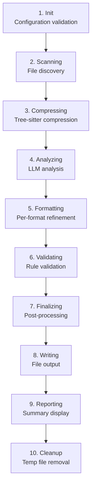

# Rule Generation Pipeline

[TOC]

ruley processes codebases through a 10-stage pipeline. Each stage has a clear responsibility and transitions cleanly to the next. The `PipelineContext` carries state through all stages.

## Pipeline Stages

## Stage 1: Init

**Module**: `src/lib.rs`

- Validates the repository path exists
- Creates the `.ruley/` cache directory
- Cleans up old temporary files (24-hour threshold)
- Ensures `.ruley/` is in `.gitignore`
- Loads previous run state from `.ruley/state.json`

## Stage 2: Scanning

**Module**: `src/packer/`

- Discovers all files in the repository
- Respects `.gitignore` rules via the `ignore` crate
- Applies `--include` and `--exclude` glob patterns
- Identifies file languages for compression
- Caches the file list to `.ruley/` for debugging

If `--repomix-file` is provided, scanning is skipped and the pre-packed file is used directly.

## Stage 3: Compressing

**Module**: `src/packer/compression/`

- Reads discovered files and their content
- When `--compress` is enabled, uses tree-sitter grammars to extract structural elements (functions, classes, types) while removing implementation details
- Calculates compression metadata (file count, original size, compressed size, ratio)
- Target compression ratio: ~70% token reduction

Without `--compress`, files are included at full size.

## Stage 4: Analyzing

**Module**: `src/llm/`, `src/generator/`

This is the core LLM interaction stage:

1. **Tokenize**: Count tokens in the compressed codebase using the provider's tokenizer
2. **Chunk**: If the codebase exceeds the provider's context window, split into chunks with configurable overlap
3. **Cost estimate**: Calculate and display estimated cost
4. **Confirm**: Prompt the user to approve (unless `--no-confirm`)
5. **Analyze**: Send each chunk to the LLM with the analysis prompt
6. **Merge**: If multi-chunk, perform an additional LLM call to merge chunk analyses
7. **Parse**: Extract structured `GeneratedRules` from the LLM response

The analysis prompt asks the LLM to identify:

- Project conventions and coding style
- Architecture patterns and module structure
- Error handling approaches
- Testing practices
- Naming conventions

## Stage 5: Formatting

**Module**: `src/generator/`

For each requested output format:

1. Build a format-specific refinement prompt with the analysis result
2. Call the LLM to generate format-adapted content
3. Store the result in `GeneratedRules.rules_by_format`

Each format refinement is a separate LLM call to ensure format-specific conventions are followed (e.g., YAML frontmatter for Cursor, markdown for Claude).

## Stage 6: Validating

**Module**: `src/utils/validation.rs`

Validates generated rules against multiple criteria:

- **Syntax validation**: Format-specific structure checks (valid YAML, valid frontmatter, etc.)
- **Schema validation**: Required fields and structure
- **Semantic validation** (configurable):
  - File paths referenced in rules exist in the codebase
  - No contradictory rules
  - Cross-format consistency
  - Languages/frameworks match the actual codebase

If validation fails and `--retry-on-validation-failure` is set, ruley sends the errors back to the LLM for auto-fix (up to `max_retries` attempts).

## Stage 7: Finalizing

**Module**: `src/utils/finalization.rs`

Post-processing of validated rules:

- **Metadata injection**: Adds generation timestamp, ruley version, and provider info
- **Deconfliction**: If existing rule files are present, uses an LLM call to merge new rules with existing ones (unless `--no-deconflict`)
- **Formatting normalization**: Normalizes line endings and trailing whitespace
- **Post-finalize smoke validation**: Re-validates after finalization to catch any introduced errors

## Stage 8: Writing

**Module**: `src/output/`

Writes rule files to disk:

- Resolves output paths (format defaults, config overrides, `--output` flag)
- Applies conflict resolution strategy (`prompt`, `overwrite`, `skip`, `smart-merge`)
- Creates backups when overwriting
- Reports what was written (created, updated, skipped, merged)

## Stage 9: Reporting

**Module**: `src/utils/summary.rs`

Displays a summary of the pipeline run:

- Files analyzed
- Tokens processed
- Compression ratio (if applicable)
- Total LLM cost
- Elapsed time
- Output files written

## Stage 10: Cleanup

**Module**: `src/lib.rs`, `src/utils/cache.rs`

Final cleanup:

- Saves pipeline state to `.ruley/state.json` (for future runs)
- Cleans up temporary files in `.ruley/`
- Transitions to the `Complete` terminal state

## Dry Run Mode

When `--dry-run` is specified, the pipeline runs stages 1-3 (Init, Scanning, Compressing), displays what would be processed (file count, token estimate, cost), and exits without making any LLM calls.
