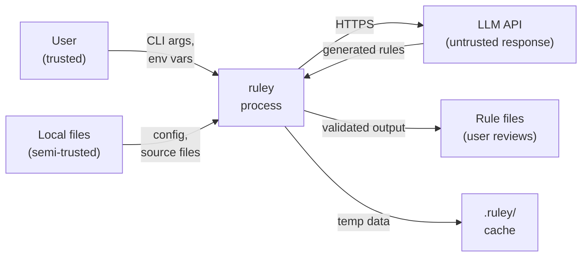

# Security Assurance Case

[TOC]

This document provides a structured security assurance case for ruley, identifying the attack surface, threat model, and mitigations in place.

## Attack Surface

ruley's attack surface is limited by design. It is a CLI tool that reads local files and makes outbound API calls.

### Entry Points

| Entry Point           | Description                       | Trust Level  |
| --------------------- | --------------------------------- | ------------ |
| CLI arguments         | User-provided flags and paths     | Untrusted    |
| Configuration files   | TOML files loaded from disk       | Semi-trusted |
| Environment variables | API keys and overrides            | Trusted      |
| Repository files      | Source files scanned for analysis | Untrusted    |
| LLM API responses     | Generated content from providers  | Untrusted    |
| Repomix files         | Pre-packed XML input files        | Untrusted    |

### Exit Points

| Exit Point           | Description                                        |
| -------------------- | -------------------------------------------------- |
| Generated rule files | Written to disk at user-specified or default paths |
| LLM API requests     | Outbound HTTPS calls to provider endpoints         |
| Console output       | Progress, cost estimates, summaries                |
| Cache files          | `.ruley/` directory for state and temp files       |

## Threat Model

### T1: Credential Leakage

**Threat**: API keys exposed in error messages, logs, or generated output.

**Mitigations**:

- API keys are read from environment variables only, never persisted
- Error messages do not include API key values
- Generated rule files do not contain API keys
- Logging does not expose credentials

### T2: Path Traversal

**Threat**: Malicious file paths in config or LLM responses writing outside the project directory.

**Mitigations**:

- Output paths are resolved relative to the project root
- The `output` module validates write paths
- Config file paths are canonicalized during discovery

### T3: Command Injection

**Threat**: Crafted CLI arguments or config values executing unintended commands.

**Mitigations**:

- clap validates all CLI input with `value_parser` and `PossibleValuesParser`
- Config values are deserialized through serde (no shell evaluation)
- No shell commands are executed from user input

### T4: Prompt Injection via Codebase

**Threat**: Malicious content in scanned source files influencing LLM output to produce harmful rules.

**Mitigations**:

- Generated rules are validated (syntax, schema, semantic checks)
- Validation detects contradictory rules and unrealistic references
- Users review generated rules before committing to their repository
- Finalization stage can deconflict with existing rules

### T5: Denial of Service

**Threat**: Crafted input causing excessive resource consumption (memory, CPU, network).

**Mitigations**:

- Token counting prevents unbounded LLM calls
- Chunk size limits cap memory usage per chunk
- Cost confirmation requires explicit user approval before expensive operations
- Bounded concurrency in async operations

### T6: Supply Chain Compromise

**Threat**: Compromised dependencies or build artifacts.

**Mitigations**:

- `cargo audit` checks for known vulnerabilities in CI
- `cargo deny` enforces license and duplicate dependency policies
- GitHub Actions pinned to commit SHAs (not mutable tags)
- CodeQL static analysis on every PR
- OSSF Scorecard monitoring
- Sigstore artifact signing

## Code Safety Guarantees

| Guarantee               | Enforcement                              |
| ----------------------- | ---------------------------------------- |
| No unsafe code          | `unsafe_code = "deny"` in `[lints.rust]` |
| No unwrap in production | `unwrap_used = "deny"` in clippy config  |
| No panic in production  | `panic = "deny"` in clippy config        |
| Zero clippy warnings    | `-D warnings` enforced in CI             |
| Dependency auditing     | `cargo audit` and `cargo deny` in CI     |

## Data Flow Security

Key security boundaries:

- **Input boundary**: All CLI arguments validated by clap; config files deserialized by serde
- **Network boundary**: Only HTTPS outbound to configured providers; no inbound connections
- **Output boundary**: Generated rules validated before writing; paths resolved relative to project root
- **Trust boundary**: LLM responses treated as untrusted input; validated before use

## Updating This Document

This document must be updated when:

- New entry points are added (e.g., new input sources)
- New exit points are added (e.g., new output destinations)
- New dependencies are introduced that handle untrusted input
- The network communication model changes
- New LLM providers are added
